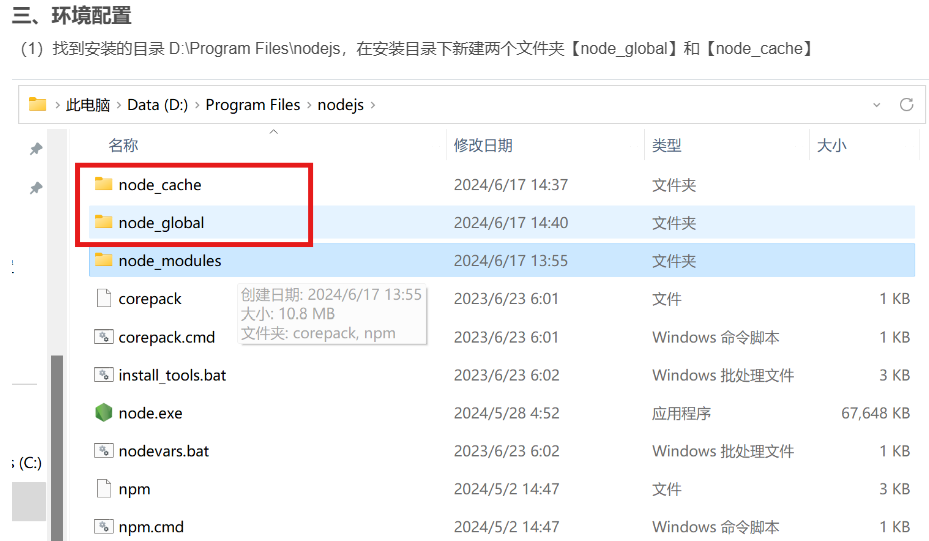
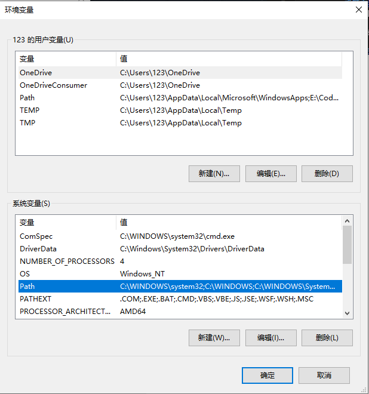
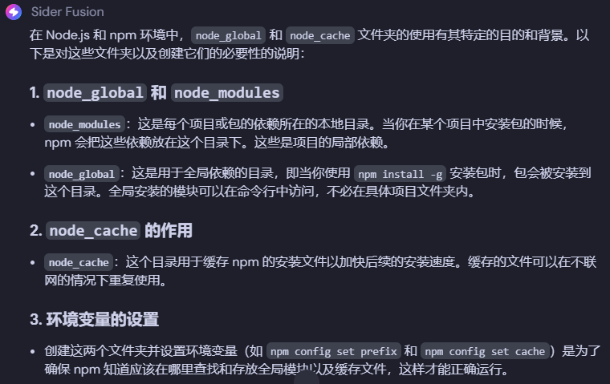
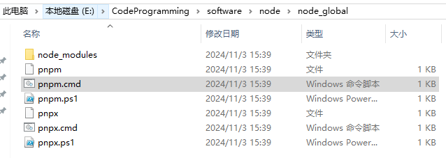
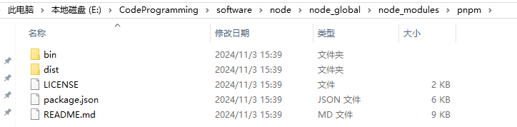

## 安装好node之后需要创建文件夹
{width=700}

然后执行 以下两条命令
{width=700}

## 在系统变量中创建NODE_PATH的必要性
{width=700}

{width=700}

{width=700}

## 简化版设置环境变量(系统变量)
{width=600}

## 在node_global中新建一个node_modules的原因
{width=600}

{width=700}

{width=700}

## 两行命令设置 npm全局安装和缓存设置
npm config set prefix "E:\CodeProgramming\software\node\node_global"

npm config set cache "E:\CodeProgramming\software\node\node_cache"
{width=700}

{width=700}

{width=700}

## 这两条命令在任何地方打开都可以
{width=700}

{width=700}

{width=700}

## node下的node_modules  和  node下的node_global下的node_modules区别
{width=700}

{width=700}

{width=700}

## pnpm程序放在了node_global文件夹下
node_modules下 因为已经设置了环境变量

所以会自动放在这个node_global文件夹下

而node_modules下的pnpm下的bin文件夹 

一开始我以为要把pnpm启动程序放进bin一个层级文件夹

但是不用 当执行pnpm时会自动去 

node_global/node_modules/pnpm/bin等等找文件 所以根本不用担心这里
{width=700}

{width=700}