## 看题直接gpt出答案理解一波先
理解完 再重来

不要一上去就自己想 不现实

## 移除元素
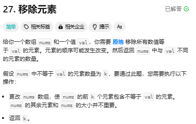{width=600px}
nums[k]是根据不等于val元素的数量而增加的
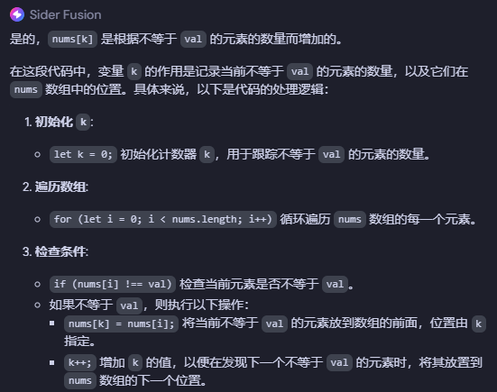{width=600px}

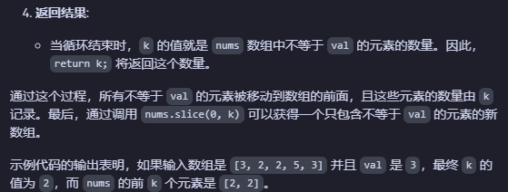{width=600px}

### nums[k]下标问题
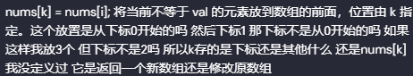{width=600px}

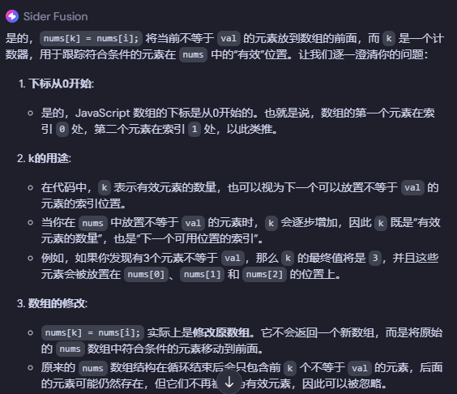{width=600px}

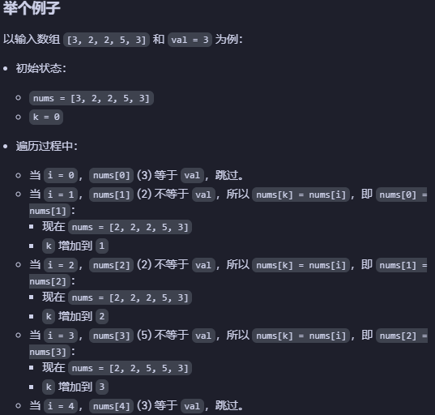{width=600px}

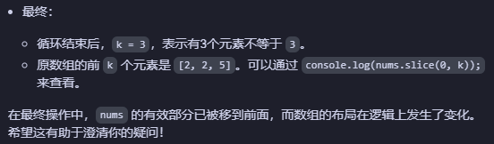{width=600px}

### 代码
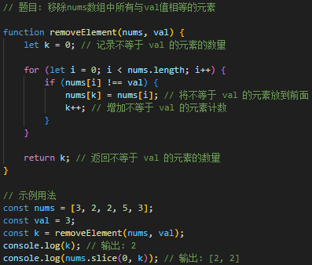{width=600px}

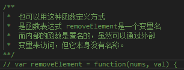{width=600px}

## 合并两个有序数组
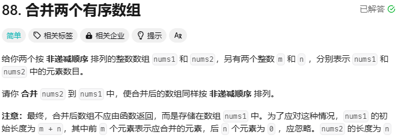{width=600px}

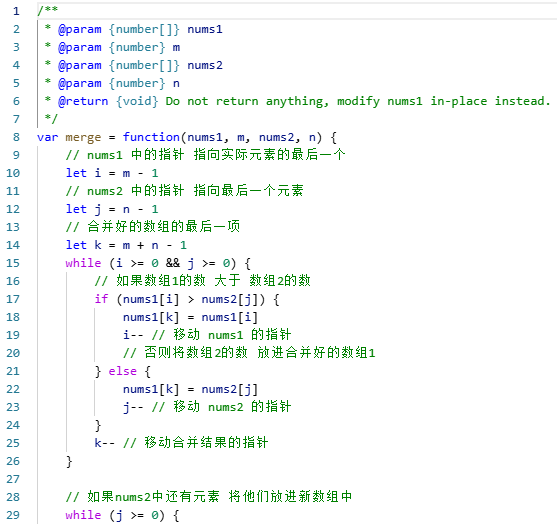{width=600px}

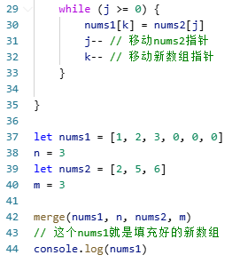{width=280px}

### 关于为什么2和6仍有可能在nums2数组中
如果 i < 0，这意味着 nums1 中的所有元素都已被放入 nums1，
但可能 nums2 中仍有剩余元素。为什么说nums2 中仍有剩余元素
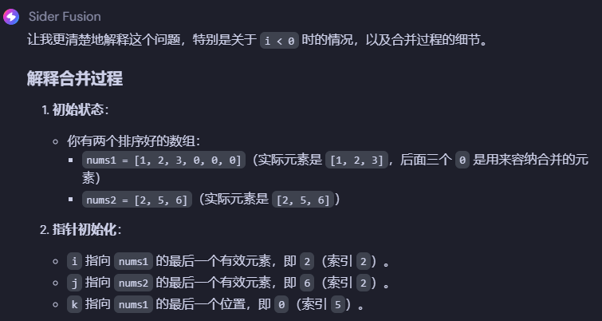{width=600px}

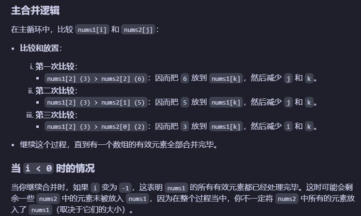{width=600px}

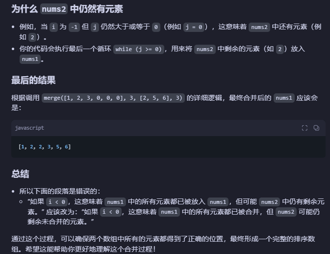{width=600px}

### 下面那段把nums2剩下的数字也放进nums1里
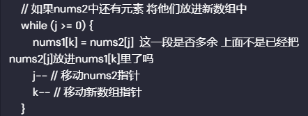{width=600px}

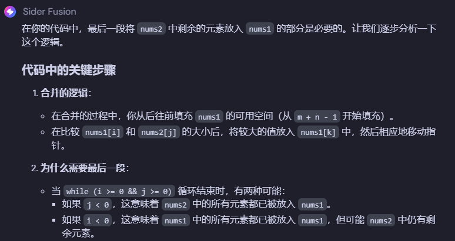{width=600px}

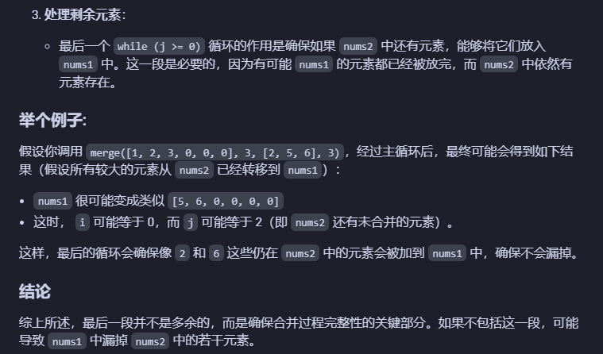{width=600px}

### 为什么说nums2中还有剩余元素
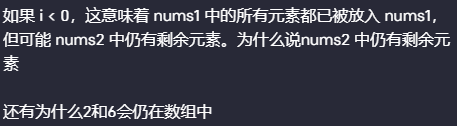{width=600px}

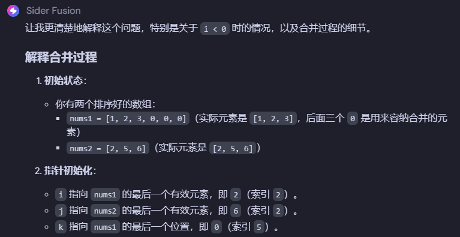{width=600px}

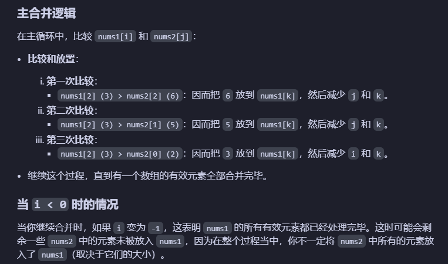{width=600px}

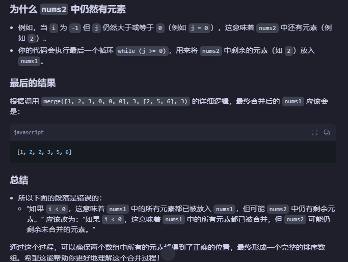{width=600px}

### 一号数组中还剩1不放进去的疑问
当下标为0 循环就停了

而1就在原来的位置上 没有问题 

是修改一号数组 不是新创建一个数组
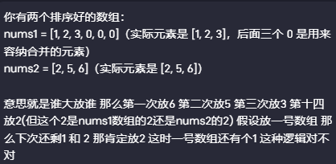{width=600px}

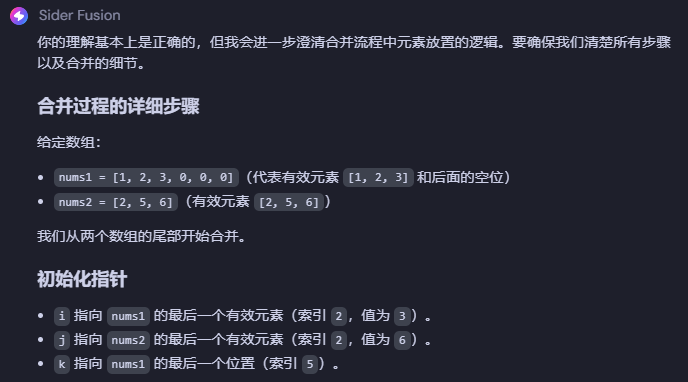{width=600px}

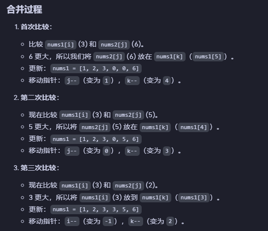{width=600px}

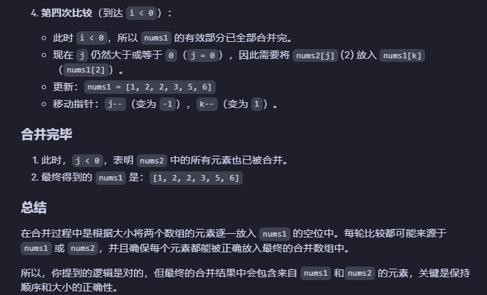{width=600px}

### 关于这里为什么i突然等于-1
其实无论是j还是i 只要等于-1循环就停了 

所以是谁等于-1并没关系
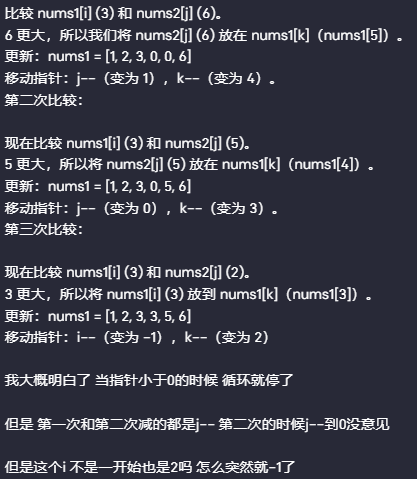{width=600px}

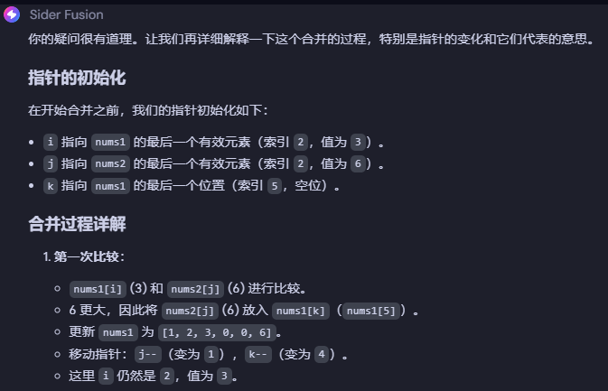{width=600px}

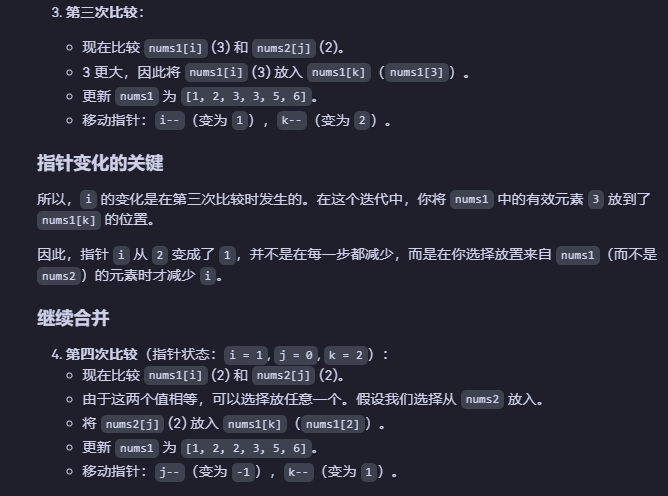{width=600px}

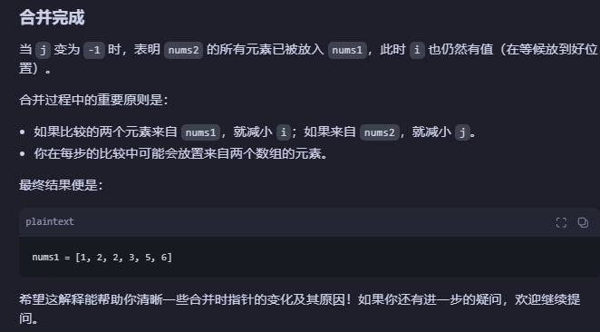{width=600px}

### 一号数组和二号数组的下标没这么整齐 
结果导致一号数组或二号数组少放(遗留)的问题
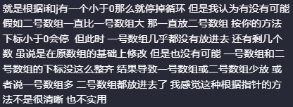{width=600px}

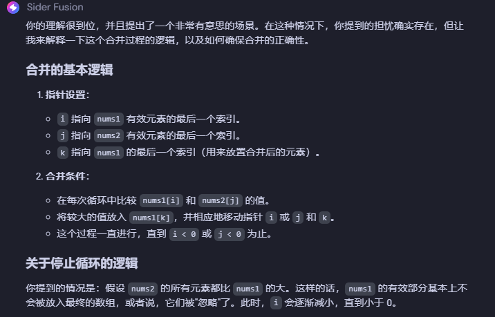{width=600px}

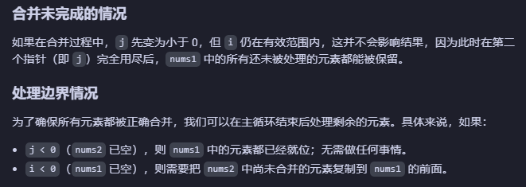{width=600px}

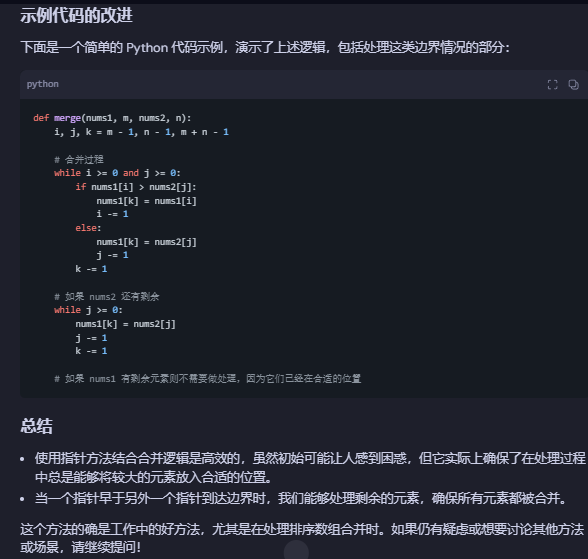{width=600px}

### 保留的数字没经过排序的问题
很可能已经全部经过了排序
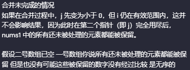{width=600px}

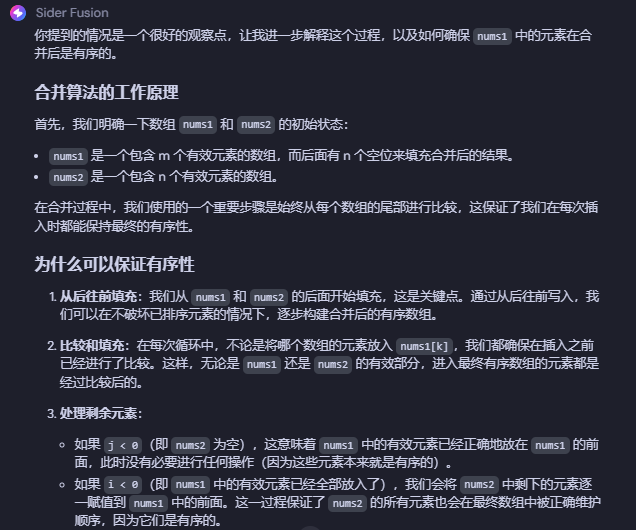{width=600px}

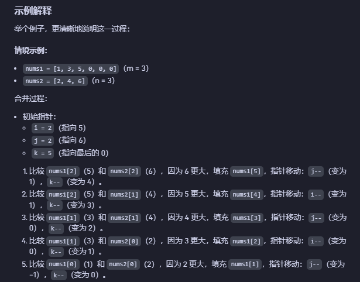{width=600px}

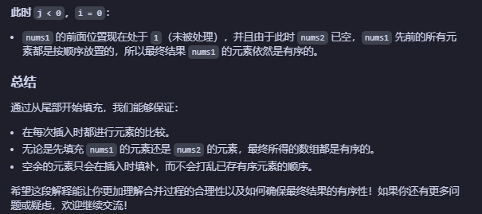{width=600px}

