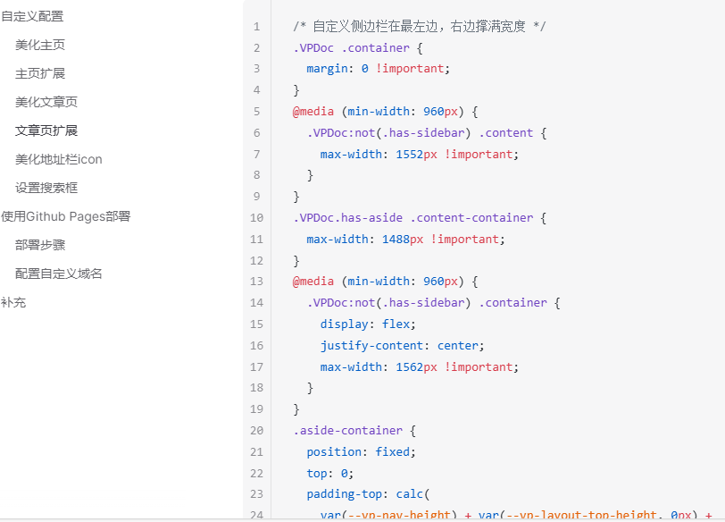
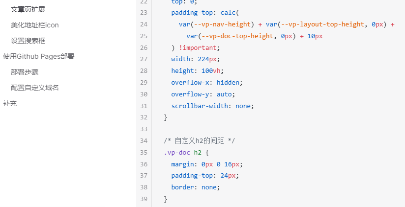
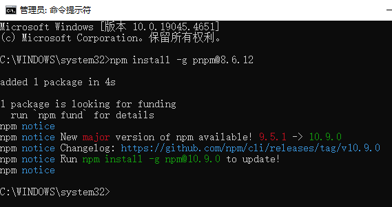
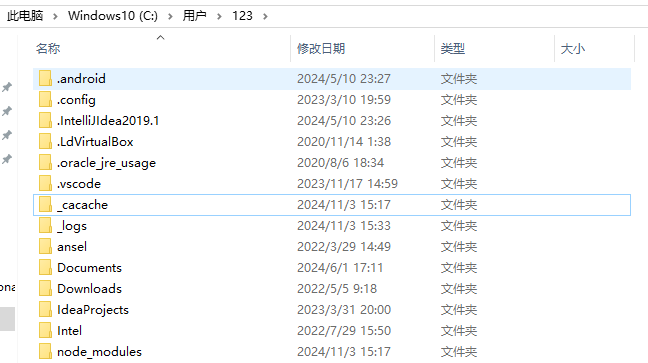
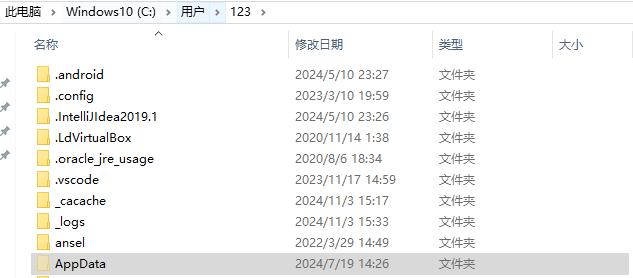

## vitepress的样式设置
挺恶心人的 那个h2的上划线

设置完就不会了

复制下面这段css 把theme/style.css全部删除 换成下面这个
{width=700}

{width=700}

## vitepress样式设置网址
https://vitepress.dev/zh/guide/custom-theme

## 文件夹折叠问题
解决方法网址

https://blog.csdn.net/mengfanyue123/article/details/106367462

{width=700}

## 使用管理员权限cmd运行pnpm
{width=700}

## 隐藏的AppData
{width=700}

{width=700}

