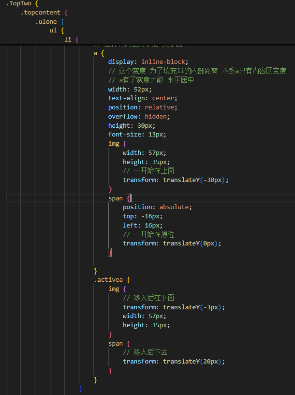
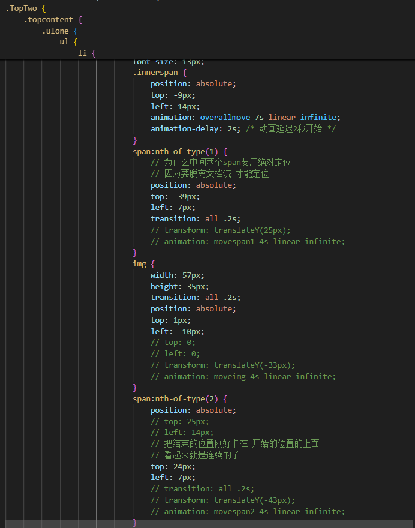
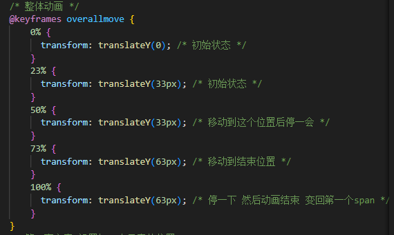
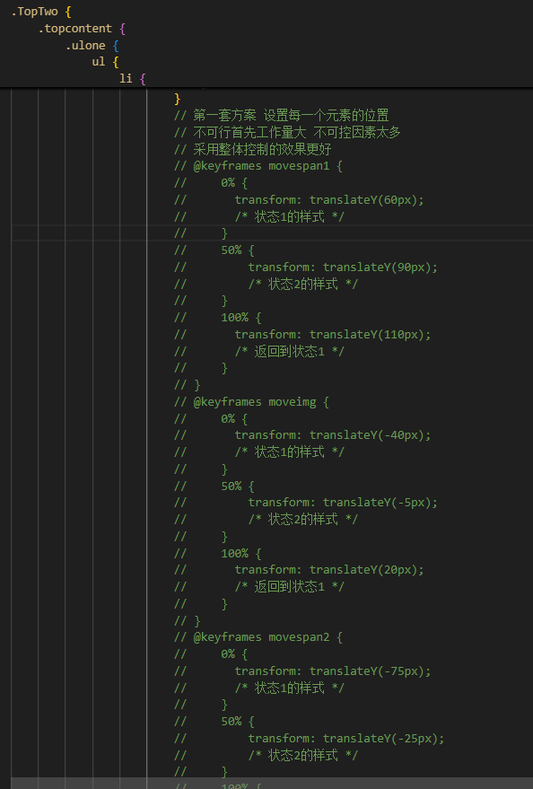
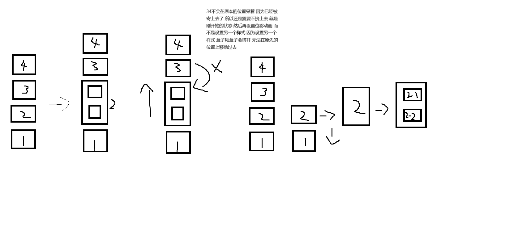
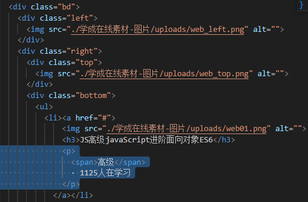
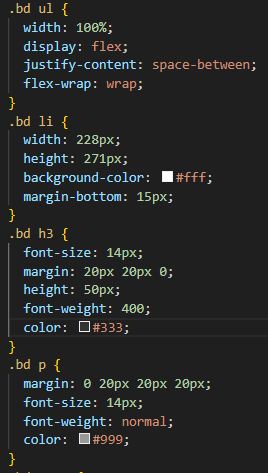
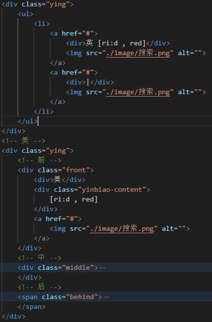
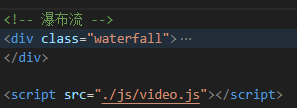
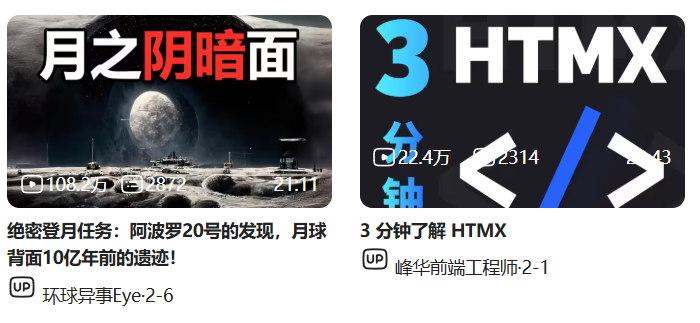

# 基础知识
## 1 基础知识--------------------------------------------------

## 原则大于方法
原则就是排除了大部分错误的路径

在原则的指导下使用方法 事半功倍

## 基本知识收集
行内块占不满 一个盒子 可以会歪

bgc #fff 白色 

bgc #ccc 灰色

移动端适配 和 做 响应式网页 是两回事

span i 标签 垂直居中用 vertical-align: middle;

使用span慎重可能有默认边距

## 注意事项
慎重使用浮动 会对布局产生影响

小的细节能做出来最好 做不出来正常 单人开发精力有限 放弃也可

## 标签语义化 简洁化
标签语义化(html标签要用得对) 特点是即使没有css 可读性也很强
也就是说要用对HTML 并且简单健壮

### 良好的HTML结构特点
可读性高的 简洁的 语义性强 没有默认样式的

就算没css 可读性也很高

### 一个例子
我想要让文字在有限的空间内换行 不能使用span

最好使用textarea文本域 因为它可以自动换行

![11171]./images/11-17/1.png)

![11171]./images/11-17/2.png)

## 布局方式
三大布局方式：弹盒(第一优先级)、定位、浮动(非必要不用)


## 当代码过多时 忽略细节 只看整体 再由外而内
当遇到完全不懂的HTML结构 和 css 的时候 

最需要做的就是完全慢下来

打开控制台看 宽高 和 css属性 有没有继承 权重 

原型图

## 小图标优化或者使用svg
能用iconfont就别用图片 因为图片太大

而且小图标方便用选择器控制 只需要写后面独有的类名就可以了

格式:iconfont icon-单独类名


## 继承样式
分两种情况
1.  一次性项目 后期不用维护 可以使用继承优势 

因为增加开发效率

但时缺点是可能因为继承样式导致维护困难 所以慎重

适用于: 高重复性、一旦样式确定就不会再改的组件化开发

2.  长期项目 不建议使用 除了极个别的高重复性属性

推荐单独样式 可操作性高 正常都使用单独样式 

避免后期维护困难

## css学习方法⭐:
-   学习法

    1级学习法：模仿、复制、重复

    2级学习法： 遇到任何问题使用解耦

-   视频学习(💩)

    他说了需求之后 自己先去做一遍
  
    再去和他比对 就知道自己哪里错了

    简称一跟、二做、三抄、四理解自己写

    也可以直接三抄、自己写 是最快的

-   自己要写时候的方法⭐

    html清楚结构

    css直接抄代码理解 再理解 再刷

    重点就是 不停的理解 和 重复刷 直到彻底会

    不要取自我创造 效率最低

-   自己写网页css顺序优化

    自己写第一遍 痛苦过 第二遍理解深刻 第三遍在理解的基础上再写一遍 ⭐

    自己全篇跟视频写 不回头看 ×

    自己全篇做 做完才回去看他 ×

    自己全篇写 一个小模块完成了就回去看看他的复盘 ×

-   html+css 代码理解流程⭐⭐⭐⭐⭐

    理清html结构 然后再从头到尾慢慢看样式 必要时可以像上面那样写一遍

## pxcook截取网页的正确方法
首先需要在浏览器的 开发者工具中 运行命令 输入 "屏幕"

选择全尺寸截图

把图片在ps中打开 注意此时仅为第一步 

打开目标网页 开发者工具 把鼠标指针放到html查看宽高

在ps中 另存为 输入 html的正确宽高 保存

再次在ps中打开图片 把图片保存为psd 然后才可以在pxcook中打开


# 开发前提
## 2 开发前提--------------------------------------------------

## 选择器优化
很多地方用同一个属性的，那就把这个属性 加在他们的父级 共同设置样式


## 错误排查方法

### 第一种 给盒子背景颜色 可以直观的调整样式
全面覆盖法 当不知道是li要设置宽高 还是a要设置宽高的时候 

当它们都加上背景颜色来调就很容易分辨了 

然后给li加大宽高 观察错误

## 应对类名会使用完的方法:

### 原则
-   使用英语单词 的父级要应用不同的类名 这样就可以区分了

-   css样式的类名后代选择器最好不要选择超过三个 不然权重高 后面容易出错

-   less 最好使用单独样式 因为less已经是最便捷的了 如果不是为了组件化开发
建议还是 每个单独模块的css都单独写 不然因为less嵌套层级深 如果发生不可
控制的错误 会因为继承优先级混乱 而导致几乎无法控制样式 

### 方法
-   单词前缀法 bottom里的 top里的 left 可以写成bt-left

-   驼峰前缀法 比如用驼峰TopOne、TopTwo...

-   也可以top-one、bottom-one 但还是推荐驼峰


# 开发前提
## 3 开发技巧--------------------------------------------------

## 原则(错误路径&&注意事项)

### li里面不能放div
不然就有溢出 比如li加内边距 

然后里面的div宽度会超出设置的范围 自成一体

### 类名使用优先级
元素选择器 > 类名 > nth伪类

能用元素选择器就别用类名 因为取类名浪费时间

而且一个良好的HTML结构不需要多的标签 

只需要元素选择器就可以 去设置CSS

### 该死的移入移出 花了我两个小时
-   首先这个移入移出的层级不要放在a作用域里面 不然可能无法生效 

-   还有当想要实现上下移动的效果时 要给移动位置的元素添加绝对定位 再用

    位移transform: translateY(-30px); 就可以移动了


#### 第一次的方案(已弃用)
当鼠标移入之后 第一个下去

中间那个盒子也下去 单纯的切换效果

就是在a外面写一个 .activea类 用来切换
{width=400px}

#### 第二次的方案(已弃用)
写一个状态类名 然后在这个类名中写

每一个盒子的位置 记录状态 然后

分别向父盒子添加状态类名测试位置

之后发现每一个盒子单独不好控制 所以引入第三种

整体控制法

#### 对父盒子进行整体的移动控制(★)
采用整体控制的效果更好 可控性高

首先给动画设置延迟几秒后开始 

然后设置动画时长和关键帧动画的百分比 

动画百分比要停顿 达到静止的感觉

然后第三个盒子的结束位置要匹配第一个盒子的开始

位置这样当动画结束 第三个盒子就会变回第一个盒子开始新一轮的动画
{width=400px}

{width=400px}

其它方案关闭
{width=400px}


### 又是一个不可能实现的想法
-   首先第一步就不可能 因为宽高是往 右下增加

    不可能往上面增加 即使使用位移也只是障眼法 

    无法推动上面的盒子往上

-   而且3号盒子 要下来时 2号盒子的收缩也是问题



## 版心盒子
版心盒子最重要的两个东西就是 宽度 和 页面水平居中

所有使用版心盒子的DOM体 都会被卡在页面中间

```css
.w {
    margin: 0 auto; 页面自动居中 ★
    width: 92%; 使用百分比版心盒子 ★
    // width: 1402px; 不使用固定宽度
    // background-color: rgb(221, 221, 218); (非必要)
}
```

## 列表设置
原则:

宽高一般给li不给ul

### 第一种通用套路
1.  第一遍设置外层盒子宽高 

2.  设置ul弹性盒(li就会横放)

3.  设置li的宽高 

4.  li里面内容的设置(比如a的字体大小、字体颜色)
{width=450px}

{width=250px}

### 列表还是要用ul做 
用ul做列表 比 div做列表 

语义化好 简洁 好控制
{width=250px}


## 三个盒子的横条

### 第一种方式
设置第二部分的宽度 让第三部分 去右边

1.  首先ul设置弹盒 让li横放

2.  同时ul还设置了内边距 把li卡在正中间

3.  而中间的部分 因为宽设置比较大 所以 修改兴趣 跑右边去了
{width=700px}

### 第二种方式
三个横排摆放的东西 可以选中间的盒子设置左右边距 

这样就不用左一下右一下

## 设置img和span 的垂直居中 
解决a标签内行内元素和图片的垂直居中

给img 设置vam就可以了


修改前

修改后


## a标签的HTML摆放和直接内容两端对齐
a弹盒后两端对齐 就可以让

前端开发 和 后面的i标签 两端对齐

html


css


效果
{width=200px}

## 设置a的内边距 不用设置li的内边距 
内层a的内边距设置

这个内边距挤a的内容区就行了

不用li去挤a的盒子
{width=600px}

{width=200px}

## 设置h3的内边距 而不是设置外层盒子对h3的内边距
也是内边距的问题 挤h3的内容就可以了 不用right挤h3

html


css


## 盒子内容区水平垂直居中的方法

弹盒+aic+jcc

左右内边距 再用上内边距调整位置


## js标签移入 div后 div不能折叠bug
{width=200px}

剪切里面的代码 之后删除重新放会原位

# 开发注意事项
## 4 注意事项--------------------------------------------------

## 为什么当页面缩小 盒子也会跟着缩小(自己没做响应式也会)
并且盒子还会塌陷 跑到下面去

很大概率是父盒子没加宽度⭐

只加高度会让下面的盒子上不来📚 不加宽度当浏览器窗口变化就会塌陷

## 如果出现字体高度不一致 可以考虑有的地方高度没有设置
像这个就是h4的高度没有设置导致的 高度不一致问题

从上到下依次是

img

table表格(绝对定位)

h4(没设置高度就会塌陷)❗
{width=200px}


      


