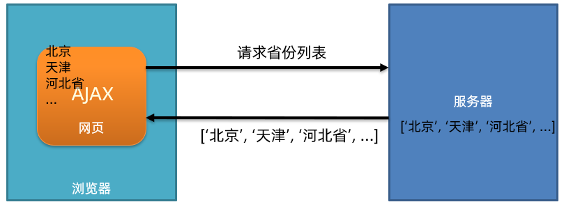
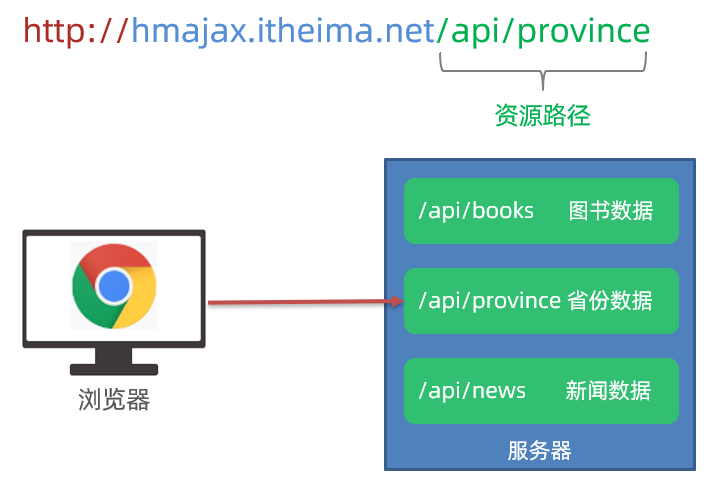
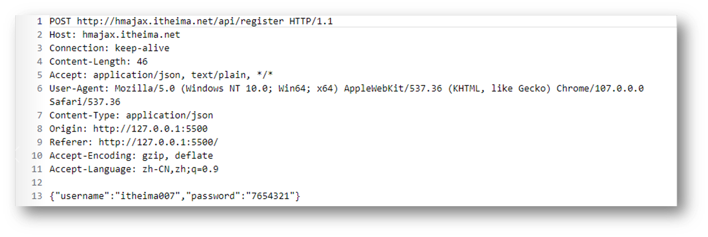
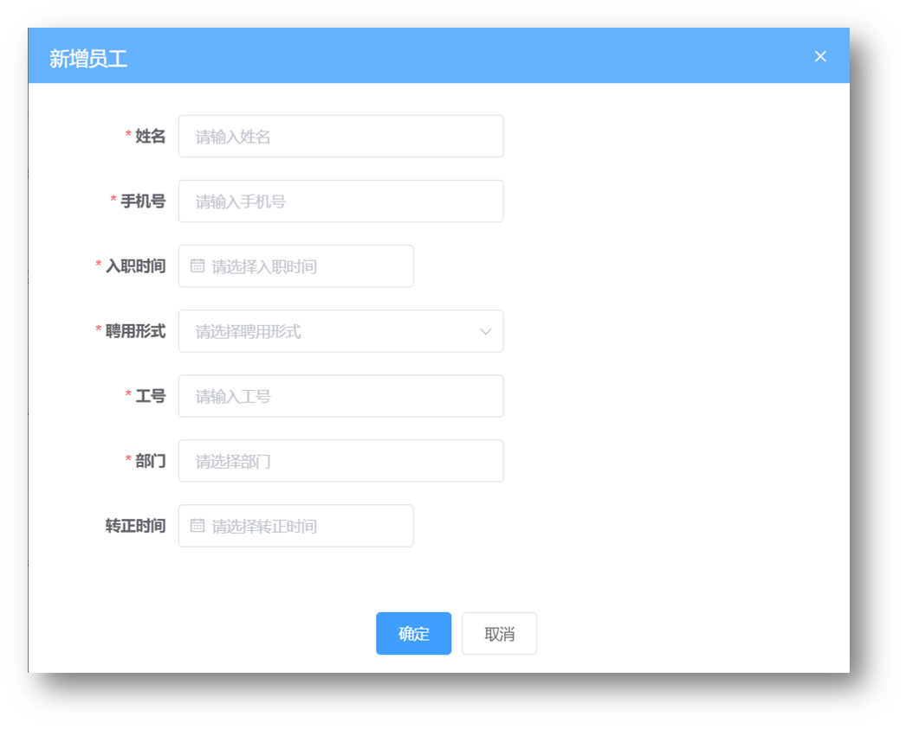

# Day01_Ajax入门

## 区别
查询(省份)要get => params

提交(登录)要post => data

## 知识点自测

1. 如下对象取值的方式哪个正确?

   ```js
   let obj = {
       name: '黑马'
   }
   ```

   A: obj.a

   B: obj()a

   <details>
   <summary>答案</summary>
   <ul>
   <li>A选项正确</li>
   </ul>
   </details>


2. 哪个赋值会让浏览器解析成标签显示?

   ```js
   let ul = document.querySelector('#ul')
   let str = `<span>我是span标签</span>`
   ```

   A: ul.innerText = str

   B: ul.innerHTML = str

   <details>
   <summary>答案</summary>
   <ul>
   <li>选择B, innerText会把字符串当做普通文本现在在ul标签之间, innerHTML会试着把字符串解析成标签, 如果是普通文本则显示普通文本字符串</li>
   </ul>
   </details>


3. 哪个是获取输入框值的方式?

   ```js
   let theInput = document.querySelector('#input')
   ```

   A: theInput.innerHTML

   B: theInput.value

   <details>
   <summary>答案</summary>
   <ul>
   <li>答案是B, 表单标签设置或获取值用value属性, 其他标签用innerHTML/innerText, 进行设置/获取</li>
   </ul>
   </details>


4. 哪个是用于获取标签内容?

   ```js
   let theP = document.querySelector('#p')
   ```

   A: theP.innerHTML = '内容'

   B: theP.innerHTML

   <details>
   <summary>答案</summary>
   <ul>
   <li>答案是B, 单独出现是获取值在原地, 如果看到=这个符号, 是把右侧的值赋予给左侧的属性, 影响标签展示效果</li>
   </ul>
   </details>


5. 哪个是数组的映射方法？

   A: arr.forEach

   B: arr.map

   <details>
   <summary>答案</summary>
   <ul>
   <li>答案是B</li>
   </ul>
   </details>


6. 数组转字符串并指定拼接符的是哪个?

   A: arr.join()

   B: arr.split()

   <details>
   <summary>答案</summary>
   <ul>
   <li>答案是A</li>
   </ul>
   </details>


7. 函数传参的方式哪个是正确的？

   ```js
   function showAlert(msg, className) {}
   ```

   A：showAlert('消息', '类名')

   B：showAlert()

   <details>
   <summary>答案</summary>
   <ul>
   <li>答案是A</li>
   </ul>
   </details>


8. 以下哪套代码可以实现对象属性的简写？

   A：

   ```js
   const username = '老李'
   let obj = {
     username: username
   }
   ```

   B：

   ```js
   const user = '老李'
   let obj = {
     username: user
   }
   ```

   <details>
   <summary>答案</summary>
   <ul>
   <li>答案是A</li>
   </ul>
   </details>


9. 以下代码的值是多少？

   ```js
   const age = 10
   const result = age > 18 ? '成年了' : '未成年'
   ```

   A：‘成年了’

   B：‘未成年’

   <details>
   <summary>答案</summary>
   <ul>
   <li>答案是B</li>
   </ul>
   </details>


10. 以下哪个方法可以添加一个额外类名？

    A：标签对象.classList.add()

    B：标签对象.classList.contains()

    <details>
    <summary>答案</summary>
    <ul>
    <li>答案是A</li>
    </ul>
    </details>


## 目录

* AJAX 概念和 axios 使用
* 认识 URL
* URL 查询参数
* 常用请求方法和数据提交
* HTTP协议-报文
* 接口文档
* 案例 - 用户登录
* form-serialize 插件


## 学习目标

1. 掌握 axios 相关参数，从服务器获取并解析展示数据
1. 掌握接口文档的查看和使用
1. 掌握在浏览器的 network 面板中查看请求和响应的内容
1. 了解请求和响应报文的组成部分


## 01.AJAX 概念和 axios 使用

### 目标

了解 AJAX 概念并掌握 axios 库基本使用


### 讲解

1. 什么是 AJAX ? [mdn](https://developer.mozilla.org/zh-CN/docs/Web/Guide/AJAX/Getting_Started)

   * 使用浏览器的 XMLHttpRequest 对象 与服务器通信

   * 浏览器网页中，使用 AJAX技术（XHR对象）发起获取省份列表数据的请求，服务器代码响应准备好的省份列表数据给前端，前端拿到数据数组以后，展示到网页

     

2. 什么是服务器？

   * 可以暂时理解为提供数据的一台电脑

3. 为何学 AJAX ?

   * 以前我们的数据都是写在代码里固定的, 无法随时变化
   * 现在我们的数据可以从服务器上进行获取，让数据变活

4. 怎么学 AJAX ?

   * 这里使用一个第三方库叫 axios, 后续在学习 XMLHttpRequest 对象了解 AJAX 底层原理
   * 因为 axios 库语法简单，让我们有更多精力关注在与服务器通信上，而且后续 Vue，React 学习中，也使用 axios 库与服务器通信

5. 需求：从服务器获取省份列表数据，展示到页面上（体验 axios 语法的使用）

   > 获取省份列表数据 - 目标资源地址：http://hmajax.itheima.net/api/province

   * 完成效果：

     

6. 接下来讲解 axios 语法，步骤：

  1. 引入 axios.js 文件到自己的网页中

     > axios.js文件链接: https://cdn.jsdelivr.net/npm/axios/dist/axios.min.js

  2. 明确axios函数的使用语法

     ```js
     axios({
       url: '目标资源地址'
     }).then((result) => {
       // 对服务器返回的数据做后续处理
     })
     ```

     > 注意：请求的 url 地址, 就是标记资源的网址
     >
     > 注意：then 方法这里先体验使用，由来后续会讲到

     

7. 对应代码

  ```html
  <!DOCTYPE html>
  <html lang="en">
  
  <head>
    <meta charset="UTF-8">
    <meta http-equiv="X-UA-Compatible" content="IE=edge">
    <meta name="viewport" content="width=device-width, initial-scale=1.0">
    <title>AJAX概念和axios使用</title>
  </head>
  
  <body>
    <!--
      axios库地址：https://cdn.jsdelivr.net/npm/axios/dist/axios.min.js
      省份数据地址：http://hmajax.itheima.net/api/province
  
      目标: 使用axios库, 获取省份列表数据, 展示到页面上
      1. 引入axios库
    -->
    <p class="my-p"></p>
    <script src="https://cdn.jsdelivr.net/npm/axios/dist/axios.min.js"></script>
    <script>
      // 2. 使用axios函数
      axios({
        url: 'http://hmajax.itheima.net/api/province'
      }).then(result => {
        console.log(result)
        // 好习惯：多打印，确认属性名
        console.log(result.data.list)
        console.log(result.data.list.join('<br>'))
        // 把准备好省份列表，插入到页面
        document.querySelector('.my-p').innerHTML = result.data.list.join('<br>') 
      })
    </script>
  </body>
  
  </html>
  ```


###  小结

1. AJAX 有什么用？

   <details>
   <summary>答案</summary>
   <ul>
   <li>浏览器和服务器之间通信，动态数据交互</li>
   </ul>
   </details>


2. AJAX 如何学：

   <details>
   <summary>答案</summary>
   <ul>
   <li>先掌握 axios 库使用，再了解 XMLHttpRequest 原理</li>
   </ul>
   </details>


3. 这一节 axios 体验步骤（语法）？

   <details>
   <summary>答案</summary>
   <ul>
   <li>引入 axios 库，使用 axios 相关语法</li>
   </ul>
   </details>
   
   

## 02.认识 URL

### 目标

了解 URL 的组成和作用


### 讲解

1. 为什么要认识 URL ? [mdn](https://developer.mozilla.org/zh-CN/docs/Web/Guide/AJAX/Getting_Started)

   * 虽然是后端给我的一个地址，但是哪部分标记的是服务器电脑，哪部分标记的是资源呢？所以为了和服务器有效沟通我们要认识一下

2. 什么是 URL ？

   * 统一资源定位符，简称网址，用于定位网络中的资源（资源指的是：网页，图片，数据，视频，音频等等）

     

3. URL 的组成?

   * 协议，域名，资源路径（URL 组成有很多部分，我们先掌握这3个重要的部分即可）

     

     

4. 什么是 http 协议 ?

   * 叫超文本传输协议，规定了浏览器和服务器传递数据的格式（而格式具体有哪些稍后我们就会学到）

     

5. 什么是域名 ?

   * 标记服务器在互联网当中的方位，网络中有很多服务器，你想访问哪一台，就需要知道它的域名才可以

     

6. 什么是资源路径 ?

   * 一个服务器内有多个资源，用于标识你要访问的资源具体的位置

     

7. 接下来做个需求，访问新闻列表的 URL 网址，打印新闻数据

   * 效果图如下：

   

   > 新闻列表数据 URL 网址：http://hmajax.itheima.net/api/news

   ```js
   axios({
     url: 'http://hmajax.itheima.net/api/news'
   }).then(result => {
     console.log(result)
   })
   ```

   > url解释：从黑马服务器使用http协议，访问/api/news路径下的新闻列表资源


###  小结

1. URL 是什么？

   <details>
   <summary>答案</summary>
   <ul>
   <li>统一资源定位符，网址，用于访问服务器上资源
   </li>
   </ul>
   </details>


2. 请解释这个 URL，每个部分作用？

   http://hmajax.itheima.net/api/news

   <details>
   <summary>答案</summary>
   <ul>
   <li>协议://域名/资源路径
   </li>
   </ul>
   </details>


## 03.URL 查询参数

### 目标

掌握-通过URL传递查询参数，获取匹配的数据


### 讲解

1. 什么是查询参数 ?

   * 携带给服务器额外信息，让服务器返回我想要的某一部分数据而不是全部数据
   * 举例：查询河北省下属的城市列表，需要先把河北省传递给服务器

     

2. 查询参数的语法 ？

   * 在 url 网址后面用?拼接格式：http://xxxx.com/xxx/xxx?参数名1=值1&参数名2=值2
   * 参数名一般是后端规定的，值前端看情况传递即可

3. axios 如何携带查询参数?

   * 使用 params 选项即可

     ```js
     axios({
       url: '目标资源地址',
       params: {
         参数名: 值
       }
     }).then(result => {
       // 对服务器返回的数据做后续处理
     })
     ```
     
     > 查询城市列表的 url地址：[http://hmajax.itheima.net/api/city](http://hmajax.itheima.net/api/city?pname=河北省)
     >
     > 参数名：pname （值要携带省份名字）

4. 需求：获取“河北省”下属的城市列表，展示到页面，对应代码：

   ```html
   <!DOCTYPE html>
   <html lang="en">
   <head>
     <meta charset="UTF-8">
     <meta http-equiv="X-UA-Compatible" content="IE=edge">
     <meta name="viewport" content="width=device-width, initial-scale=1.0">
     <title>查询参数</title>
   </head>
   <body>
     <!-- 
       城市列表: http://hmajax.itheima.net/api/city
       参数名: pname
       值: 省份名字
     -->
     <p></p>
     <script src="https://cdn.jsdelivr.net/npm/axios/dist/axios.min.js"></script>
     <script>
       axios({
         url: 'http://hmajax.itheima.net/api/city',
         // 查询参数
         params: {
           pname: '辽宁省'
         }
       }).then(result => {
         console.log(result.data.list)
         document.querySelector('p').innerHTML = result.data.list.join('<br>')
       })
     </script>
   </body>
   </html>
   ```

   

###  小结

1. URL 查询参数有什么用？

   <details>
   <summary>答案</summary>
   <ul>
   <li>浏览器提供给服务器额外信息，获取对应的数据
   </li>
   </ul>
   </details>


2. axios 要如何携带查询参数？

   <details>
   <summary>答案</summary>
   <ul>
   <li>使用 params 选项，携带参数名和值在对象结构中
   </li>
   </ul>
   </details>


## 04.案例-查询-地区列表

### 目标

巩固查询参数的使用，并查看多对查询参数如何传递


### 讲解

1. 需求：根据输入的省份名字和城市名字，查询下属地区列表

   * 完成效果如下：

     

   * 相关参数

     > 查询地区: http://hmajax.itheima.net/api/area
     >
     > 参数名：
     >
     > pname：省份名字
     >
     > cname：城市名字

   

2. 正确代码如下：

   ```js
   /*
         获取地区列表: http://hmajax.itheima.net/api/area
         查询参数:
           pname: 省份或直辖市名字
           cname: 城市名字
       */
   // 目标: 根据省份和城市名字, 查询地区列表
   // 1. 查询按钮-点击事件
   document.querySelector('.sel-btn').addEventListener('click', () => {
       // 2. 获取省份和城市名字
       let pname = document.querySelector('.province').value
       let cname = document.querySelector('.city').value
   
       // 3. 基于axios请求地区列表数据
       axios({
           url: 'http://hmajax.itheima.net/api/area',
           params: {
               pname,
               cname
           }
       }).then(result => {
           // console.log(result)
           // 4. 把数据转li标签插入到页面上
           let list = result.data.list
           console.log(list)
           let theLi = list.map(areaName => `<li class="list-group-item">${areaName}</li>`).join('')
           console.log(theLi)
           document.querySelector('.list-group').innerHTML = theLi
       })
   })
   ```

   

###  小结

1. ES6 对象属性和值简写的前提是什么？

   <details>
   <summary>答案</summary>
   <ul>
   <li>当属性名和value位置变量名同名即可简写
   </li>
   </ul>
   </details>


## 05.常用请求方法和数据提交

### 目标

掌握如何向服务器提交数据，而不单单是获取数据


### 讲解

1. 想要提交数据，先来了解什么是请求方法

   * 请求方法是一些固定单词的英文，例如：GET，POST，PUT，DELETE，PATCH（这些都是http协议规定的），每个单词对应一种对服务器资源要执行的操作

     

     

   * 前面我们获取数据其实用的就是GET请求方法，但是axios内部设置了默认请求方法就是GET，我们就没有写

   * 但是提交数据需要使用POST请求方法

2. 什么时候进行数据提交呢？

   * 例如：多端要查看同一份订单数据，或者使用同一个账号进行登录，那订单/用户名+密码，就需要保存在服务器上，随时随地进行访问

     

     

3. axios 如何提交数据到服务器呢？

   * 需要学习，method 和 data 这2个新的选项了（大家不用担心，这2个学完，axios常用的选项就都学完了）

     ```js
     axios({
       url: '目标资源地址',
       method: '请求方法',
       data: {
         参数名: 值
       }
     }).then(result => {
       // 对服务器返回的数据做后续处理
     })
     ```
     
     

4. 需求：注册账号，提交用户名和密码到服务器保存

   > 注册用户 URL 网址：http://hmajax.itheima.net/api/register
   >
   > 请求方法：POST
   >
   > 参数名：
   >
   > username：用户名（要求中英文和数字组成，最少8位）
   >
   > password：密码（最少6位）

   

5. 正确代码如下：

   ```js
   /*
     注册用户：http://hmajax.itheima.net/api/register
     请求方法：POST
     参数名：
       username：用户名（中英文和数字组成，最少8位）
       password：密码  （最少6位）
   
     目标：点击按钮，通过axios提交用户和密码，完成注册
   */
   document.querySelector('.btn').addEventListener('click', () => {
     axios({
       url: 'http://hmajax.itheima.net/api/register',
       method: 'POST',
       data: {
         username: 'itheima007',
         password: '7654321'
       }
     })
   })
   ```

   


###  小结

1. 请求方法最常用的是哪2个，分别有什么作用？

   <details>
   <summary>答案</summary>
   <ul>
   <li>POST 提交数据，GET 查询数据
   </li>
   </ul>
   </details>

2. axios 的核心配置项？

   <details>
   <summary>答案</summary>
   <ul>
   <li>url：目标资源地址，method：请求方法，params：查询参数，data：提交的数据
   </li>
   </ul>
   </details>


## 06.axios 错误处理

### 目标

掌握接收 axios 响应错误信息的处理语法


### 讲解

1. 如果注册相同的用户名，则会遇到注册失败的请求，也就是 axios 请求响应失败了，你会在控制台看到如图的错误：

   

2. 在 axios 语法中要如何处理呢？

   * 因为，普通用户不会去控制台里看错误信息，我们要编写代码拿到错误并展示给用户在页面上

3. 使用 axios 的 catch 方法，捕获这次请求响应的错误并做后续处理，语法如下：

   ```js
   axios({
     // ...请求选项
   }).then(result => {
     // 处理成功数据
   }).catch(error => {
     // 处理失败错误
   })
   ```

4. 需求：再次重复注册相同用户名，提示用户注册失败的原因

   

   

5. 对应代码

   ```js
   document.querySelector('.btn').addEventListener('click', () => {
       axios({
         url: 'http://hmajax.itheima.net/api/register',
         method: 'post',
         data: {
           username: 'itheima007',
           password: '7654321'
         }
       }).then(result => {
         // 成功
         console.log(result)
       }).catch(error => {
         // 失败
         // 处理错误信息
         console.log(error)
         console.log(error.response.data.message)
         alert(error.response.data.message)
       })
   })
   ```


###  小结

1. axios 如何拿到请求响应失败的信息？

   <details>
   <summary>答案</summary>
   <ul>
   <li>通过 axios 函数调用后，在后面接着调用 .catch 方法捕获
   </li>
   </ul>
   </details>


## 07.HTTP 协议-请求报文

### 目标

了解 HTTP 协议中，请求报文的组成和作用


### 讲解

1. 首先，HTTP 协议规定了浏览器和服务器返回内容的<span style="color: red;">格式</span>

2. 请求报文：是浏览器按照协议规定发送给服务器的内容，例如刚刚注册用户时，发起的请求报文：

   

   

3. 这里的格式包含：

   * 请求行：请求方法，URL，协议
   * 请求头：以键值对的格式携带的附加信息，比如：Content-Type（指定了本次传递的内容类型）
   * 空行：分割请求头，空行之后的是发送给服务器的资源
   * 请求体：发送的资源

4. 我们切换到浏览器中，来看看刚才注册用户发送的这个请求报文以及内容去哪里查看呢

5. 代码：直接在上个代码基础上复制，然后运行查看请求报文对应关系即可


### 小结

1. 浏览器发送给服务器的内容叫做，请求报文

2. 请求报文的组成是什么？

   <details>
   <summary>答案</summary>
   <ul>
   <li>请求行，请求头，空行，请求体
   </li>
   </ul>
   </details>

3. 通过 Chrome 的网络面板如何查看请求体？

   


## 08.请求报文-错误排查

### 目标

了解学习了查看请求报文之后的作用，可以用来辅助错误排查


### 讲解

1. 学习了查看请求报文有什么用呢？
   * 可以用来确认我们代码发送的请求数据是否真的正确
2. 配套模板代码里，对应 08 标题文件夹里是我同桌的代码，它把登录也写完了，但是无法登录，我们来到模板代码中，找到运行后，在<span style="color: red;">不逐行查看代码的情况下</span>，查看请求报文，看看它登录提交的相关信息对不对，帮他找找问题出现的原因
3. 发现请求体数据有问题，往代码中定位，找到类名写错误了
4. 代码：在配套文件夹素材里，找到需要对应代码，直接运行，根据报错信息，找到错误原因


### 小结

1. 学会了查看请求报文，对实际开发有什么帮助呢？

   <details>
   <summary>答案</summary>
   <ul>
   <li>可以快速确认我们发送的内容是否正确
   </li>
   </ul>
   </details>


## 09.HTTP 协议-响应报文

### 目标

了解响应报文的组成


### 讲解

1. 响应报文：是服务器按照协议固定的格式，返回给浏览器的内容

   

   

2. 响应报文的组成：

   * 响应行（状态行）：协议，HTTP响应状态码，状态信息
   * 响应头：以键值对的格式携带的附加信息，比如：Content-Type（告诉浏览器，本次返回的内容类型）
   * 空行：分割响应头，控制之后的是服务器返回的资源
   * 响应体：返回的资源

3. HTTP 响应状态码：

   * 用来表明请求是否成功完成

   * 例如：404（客户端要找的资源，在服务器上不存在）

     


### 小结

1. 响应报文的组成？

   <details>
   <summary>答案</summary>
   <ul>
   <li>响应行，响应头，空行，响应体
   </li>
   </ul>
   </details>

2. HTTP 响应状态码是做什么的？

   <details>
   <summary>答案</summary>
   <ul>
   <li>表明请求是否成功完成，2xx都是成功的
   </li>
   </ul>
   </details>


## 10.接口文档

### 目标

掌握接口文档的使用，配合 axios 与服务器进行数据交互


### 讲解

1. 接口文档：描述接口的文章（一般是后端工程师，编写和提供）
2. 接口：指的使用 AJAX 和 服务器通讯时，使用的 URL，请求方法，以及参数，例如：[AJAX阶段接口文档](https://www.apifox.cn/apidoc/project-1937884/doc-1695440)
3. 例如：获取城市列表接口样子

   
4. 需求：打开 AJAX 阶段接口文档，查看登录接口，并编写代码，完成一次登录的效果吧
5. 代码如下：

   ```js
   document.querySelector('.btn').addEventListener('click', () => {
     // 用户登录
     axios({
       url: 'http://hmajax.itheima.net/api/login',
       method: 'post',
       data: {
         username: 'itheima007',
         password: '7654321'
       }
     })
   })
   ```

   


### 小结

1. 接口文档是什么？

   <details>
   <summary>答案</summary>
   <ul>
   <li>由后端提供的描述接口的文章
   </li>
   </ul>
   </details>

2. 接口文档里包含什么？

   <details>
   <summary>答案</summary>
   <ul>
   <li>请求的 URL 网址，请求方法，请求参数和说明
   </li>
   </ul>
   </details>


## 11.案例-用户登录-主要业务

### 目标

尝试通过页面获取用户名和密码，进行登录


### 讲解

1. 先来到备课代码中，运行完成的页面，查看要完成的登录效果（登录成功和失败）

2. 需求：编写代码，查看接口文档，填写相关信息，完成登录业务

2. 分析实现的步骤
   
   1. 点击登录，获取并判断用户名和长度
   
   2. 提交数据和服务器通信
   
   3. 提示信息，反馈给用户（这节课先来完成前 2 个步骤）
   
      
   
4. 代码如下：

   ```js
   // 目标1：点击登录时，用户名和密码长度判断，并提交数据和服务器通信
   
   // 1.1 登录-点击事件
   document.querySelector('.btn-login').addEventListener('click', () => {
     // 1.2 获取用户名和密码
     const username = document.querySelector('.username').value
     const password = document.querySelector('.password').value
     // console.log(username, password)
   
     // 1.3 判断长度
     if (username.length < 8) {
       console.log('用户名必须大于等于8位')
       return // 阻止代码继续执行
     }
     if (password.length < 6) {
       console.log('密码必须大于等于6位')
       return // 阻止代码继续执行
     }
   
     // 1.4 基于axios提交用户名和密码
     // console.log('提交数据到服务器')
     axios({
       url: 'http://hmajax.itheima.net/api/login',
       method: 'POST',
       data: {
         username,
         password
       }
     }).then(result => {
       console.log(result)
       console.log(result.data.message)
     }).catch(error => {
       console.log(error)
       console.log(error.response.data.message)
     })
   })
   ```


### 小结

1. 总结下用户登录案例的思路？

   <details>
   <summary>答案</summary>
   <ul>
   <li>1. 登录按钮-绑定点击事件
   2. 从页面输入框里，获取用户名和密码
   3. 判断长度是否符合要求
   4. 基于 axios 提交用户名和密码
   </li>
   </ul>
   </details>


## 12.案例-用户登录-提示信息

### 目标

根据准备好的提示标签和样式，给用户反馈提示


### 讲解

1. 需求：使用提前准备好的提示框，来把登录成功/失败结果提示给用户

   

   

   

2. 使用提示框，反馈提示消息，因为有4处地方需要提示框，所以封装成函数

   1. 获取提示框

   2. 封装提示框函数，重复调用，满足提示需求

      功能：

      1. 显示提示框
      2. 不同提示文字msg，和成功绿色失败红色isSuccess参数（true成功，false失败）
      3. 过2秒后，让提示框自动消失

3. 对应提示框核心代码：

   ```js
   /**
    * 2.2 封装提示框函数，重复调用，满足提示需求
    * 功能：
    * 1. 显示提示框
    * 2. 不同提示文字msg，和成功绿色失败红色isSuccess（true成功，false失败）
    * 3. 过2秒后，让提示框自动消失
   */
   function alertFn(msg, isSuccess) {
     // 1> 显示提示框
     myAlert.classList.add('show')
   
     // 2> 实现细节
     myAlert.innerText = msg
     const bgStyle = isSuccess ? 'alert-success' : 'alert-danger'
     myAlert.classList.add(bgStyle)
   
     // 3> 过2秒隐藏
     setTimeout(() => {
       myAlert.classList.remove('show')
       // 提示：避免类名冲突，重置背景色
       myAlert.classList.remove(bgStyle)
     }, 2000)
   }
   ```


### 小结

1. 我们什么时候需要封装函数？

   <details>
   <summary>答案</summary>
   <ul>
   <li>遇到相同逻辑，重复代码要复用的时候
   </li>
   </ul>
   </details>

2. 如何封装一个函数呢？

   <details>
   <summary>答案</summary>
   <ul>
   <li>先明确要完成的需求，以及需要的参数，再来实现其中的细节，然后在需要的地方调用
   </li>
   </ul>
   </details>

3. 我们的提示框是如何控制出现/隐藏的？

   <details>
   <summary>答案</summary>
   <ul>
   <li>添加或移除显示的类名即可
   </li>
   </ul>
   </details>


## 13.form-serialize 插件

### 目标

使用 form-serialize 插件，快速收集目标表单范围内表单元素的值


### 讲解

1. 我们前面收集表单元素的值，是一个个标签获取的

   

2. 如果一套表单里有很多很多表单元素，如何一次性快速收集出来呢？

   

3. 使用 form-serialize 插件提供的 serialize 函数就可以办到

4. form-serialize 插件语法：

   1. 引入 form-serialize 插件到自己网页中

   2. 使用 serialize 函数

      * 参数1：要获取的 form 表单标签对象（要求表单元素需要有 name 属性-用来作为收集的数据中属性名）

      * 参数2：配置对象
        * hash：
          * true - 收集出来的是一个 JS 对象结构
          * false - 收集出来的是一个查询字符串格式
        * empty：
          * true - 收集空值
          * false - 不收集空值

5. 需求：收集登录表单里用户名和密码

6. 对应代码：

   ```html
   <!DOCTYPE html>
   <html lang="en">
   
   <head>
     <meta charset="UTF-8">
     <meta http-equiv="X-UA-Compatible" content="IE=edge">
     <meta name="viewport" content="width=device-width, initial-scale=1.0">
     <title>form-serialize插件使用</title>
   </head>
   
   <body>
     <form action="javascript:;" class="example-form">
       <input type="text" name="username">
       <br>
       <input type="text" name="password">
       <br>
       <input type="button" class="btn" value="提交">
     </form>
     <!-- 
       目标：在点击提交时，使用form-serialize插件，快速收集表单元素值
       1. 把插件引入到自己网页中
     -->
     <script src="./lib/form-serialize.js"></script>
     <script>
       document.querySelector('.btn').addEventListener('click', () => {
         /**
          * 2. 使用serialize函数，快速收集表单元素的值
          * 参数1：要获取哪个表单的数据
          *  表单元素设置name属性，值会作为对象的属性名
          *  建议name属性的值，最好和接口文档参数名一致
          * 参数2：配置对象
          *  hash 设置获取数据结构
          *    - true：JS对象（推荐）一般请求体里提交给服务器
          *    - false: 查询字符串
          *  empty 设置是否获取空值
          *    - true: 获取空值（推荐）数据结构和标签结构一致
          *    - false：不获取空值
         */
         const form = document.querySelector('.example-form')
         const data = serialize(form, { hash: true, empty: true })
         // const data = serialize(form, { hash: false, empty: true })
         // const data = serialize(form, { hash: true, empty: false })
         console.log(data)
       })
     </script>
   </body>
   
   </html>
   ```


### 小结

1. 我们什么时候使用 form-serialize 插件？

   <details>
   <summary>答案</summary>
   <ul>
   <li>快速收集表单元素的值</li>
   </ul>
   </details>

2. 如何使用 form-serialize 插件？

   <details>
   <summary>答案</summary>
   <ul>
   <li>1. 先引入插件到自己的网页中，2. 准备form和表单元素的name属性，3.使用serialize函数，传入form表单和配置对象
   </li>
   </ul>
   </details>

3. 配置对象中 hash 和 empty 有什么用？

   <details>
   <summary>答案</summary>
   <ul>
   <li>hash 决定是收集为 JS 对象还是查询参数字符串，empty 决定是否收集空值
   </li>
   </ul>
   </details>


## 14.案例-用户登录-form-serialize

### 目标

尝试通过 form-serialize 重新修改用户登录案例-收集用户名和密码


### 讲解

1. 基于模板代码，使用 form-serialize 插件来收集用户名和密码
2. 在原来的代码基础上修改即可

   1. 先引入插件

      ```html
      <!-- 3.1 引入插件 -->
      <script src="./lib/form-serialize.js"></script>
      ```

   2. 然后修改代码

      ```js
      // 3.2 使用serialize函数，收集登录表单里用户名和密码
      const form = document.querySelector('.login-form')
      const data = serialize(form, { hash: true, empty: true })
      console.log(data)
      // {username: 'itheima007', password: '7654321'}
      const { username, password } = data
      ```


### 小结

1. 如何把一个第三方插件使用在已完成的案例中？

   <details>
   <summary>答案</summary>
   <ul>
   <li>引入后，只需要使用在要修改的地方，修改一点就要确认测试一下
   </li>
   </ul>
   </details>


## 今日重点(必须会)

1. axios 的配置项有哪几个，作用分别是什么？
2. 接口文档都包含哪些信息？
3. 在浏览器中如何查看查询参数/请求体，以及响应体数据？
4. 请求报文和响应报文由几个部分组成，每个部分的作用？


## 今日作业(必完成)

参考作业文件夹的md要求


## 参考文献

1. [客户端->百度百科](https://baike.baidu.com/item/%E5%AE%A2%E6%88%B7%E7%AB%AF/101081?fr=aladdin)
2. [浏览器解释->百度百科](https://baike.baidu.com/item/%E6%B5%8F%E8%A7%88%E5%99%A8/213911?fr=aladdin)
3. [服务器解释->百度百科](https://baike.baidu.com/item/%E6%9C%8D%E5%8A%A1%E5%99%A8/100571?fr=aladdin)
4. [url解释->百度百科](https://baike.baidu.com/item/%E7%BB%9F%E4%B8%80%E8%B5%84%E6%BA%90%E5%AE%9A%E4%BD%8D%E7%B3%BB%E7%BB%9F/5937042?fromtitle=URL&fromid=110640&fr=aladdin)
5. [http协议->百度百科](https://baike.baidu.com/item/HTTP?fromtitle=HTTP%E5%8D%8F%E8%AE%AE&fromid=1276942)
6. [主机名->百度百科](https://baike.baidu.com/item/%E4%B8%BB%E6%9C%BA%E5%90%8D)
7. [端口号->百度百科](https://baike.baidu.com/item/%E7%AB%AF%E5%8F%A3%E5%8F%B)
8. [Ajax解释->百度-懂啦](https://baike.baidu.com/tashuo/browse/content?id=11fca6ecdc2c066af4c5594f&lemmaId=8425&fromLemmaModule=pcBottom&lemmaTitle=ajax)
9. [Ajax解释->MDN解释Ajax是与服务器通信而不只是请求](https://developer.mozilla.org/zh-CN/docs/Web/Guide/AJAX/Getting_Started)
10. [axios->百度(可以点击播报听读音)](https://baike.baidu.com/item/axios)
11. [axios(github)地址](https://github.com/axios/axios)
12. [axios官方推荐官网](https://axios-http.com/)
13. [axios(npmjs)地址](https://www.npmjs.com/package/axios)
14. [GET和POST区别->百度百科](https://baike.baidu.com/item/post/2171305)
15. [报文讲解->百度百科](https://baike.baidu.com/item/%E6%8A%A5%E6%96%87/3164352)
16. [HTTP状态码->百度百科](https://baike.baidu.com/item/HTTP%E7%8A%B6%E6%80%81%E7%A0%81/5053660)
17. [接口概念->百度百科](https://baike.baidu.com/item/%E6%8E%A5%E5%8F%A3/2886384)

