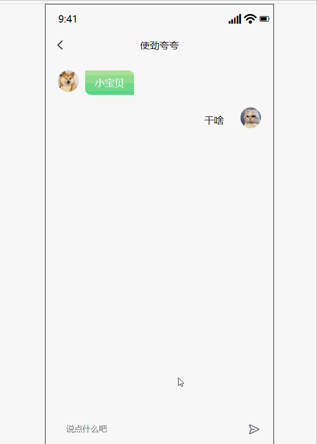
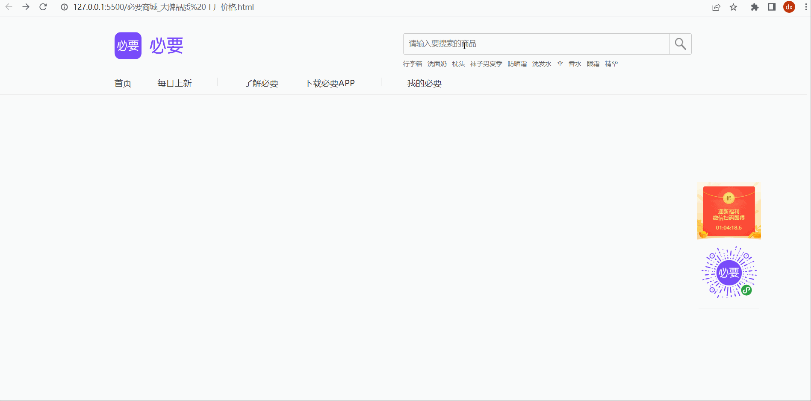
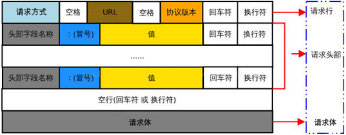

# Day01_AJAX入门

## 客观题

* 参考客观题目录下的excel

* 在线直接答题：https://ks.wjx.top/vm/OrYaZ1x.aspx# 

  > ps：本测试链接来自问卷星，请不要轻信问卷星广告！

## 主观题

### 作业1 - 微信聊天

目标：完成如下聊天效果

要求：

1. 点击发送和敲击回车键，都能发送聊天消息
2. 把自己和对方消息都展示到页面上
3. 当聊天消息出现滚动条时，始终让最后一条消息出现在视口范围内

接口文档：https://www.apifox.cn/apidoc/project-1937884/api-49760222

效果如下：配套标签和样式在文件夹内




### 作业2 - 必要商城搜索

目标：完成如下搜索效果

要求：

1. 输入要搜索的关键字，点击放大镜搜索匹配商品

接口文档：https://www.apifox.cn/apidoc/project-1937884/api-63538670

效果如下：配套标签和样式在文件夹内




## 排错题

配套文件夹内的《案例-登录》里面有 6 处错误，请帮帮这位同学实现登录效果吧


## 面试题

### 1. GET 和 POST 请求方法的区别？

1. GET和POST请求方式无区别, 本质都是一次HTTP请求(TCP链接), 而HTTP请求报文中都包含请求行, 请求头, 请求体，我们可以在相应位置携带值给服务器

2. 图解: 

   

3. 但是[GET或HEAD请求方式, 浏览器会忽略请求体](https://xhr.spec.whatwg.org/#the-send()-method), 但不代表GET/HEAD方式无法发送请求体, 使用apifox等接口调试工具是可以携带请求体的

4. 非要说区别有如下几点

   1. 浏览器回退的时候, GET不会重新提交, 而POST会重新提交表单
   2. GET会被浏览器主动缓存, POST不会
   3. 再就是url上传查询参数和请求体传参的区别了(实际上不是GET和POST区别了)
      * url上只能进行url编码, 而请求体里支持多种编码格式
      * url上的参数会保留在浏览器历史记录里, 而请求体不会被保留, 除非用代码设置


### 2. 原生Ajax的原理?

> axios库是对原生Ajax的XMLHttpRequest相关语法的封装
>
> AJAX 原理是 XMLHttpRequest 相关语法
>
> 而原生JS代码参考如下文档↓

[点我看答案](https://lamphc.github.io/fe-up/#/JavaScript/ajax?id=%e9%9d%a2%e8%af%95%e5%ae%98%ef%bc%9aajax%e5%8e%9f%e7%90%86%e6%98%af%e4%bb%80%e4%b9%88%ef%bc%9f%e5%a6%82%e4%bd%95%e5%ae%9e%e7%8e%b0%ef%bc%9f)


### 3. 箭头函数和function函数区别?

箭头函数常用做回调函数使用, 它无自己的this, 无arguments对象, 不能被new调用


### 4. 一个页面从输入 URL 到页面加载显示完成，这个过程中都发生了什么

1. 浏览器查找域名对应的 IP 地址(DNS 查询：浏览器缓存->系统缓存->路由器缓存->ISPDNS 缓存->根域名服务器) 
2. 浏览器向 Web 服务器发送一个 HTTP 请求（TCP 三次握手） 
3. （如果服务器设置了重定向）服务器 301 重定向（从 HTTP://example.com 重定向到 HTTP://www.example.com）
4. 浏览器跟踪重定向地址，请求另一个带 www 的网址 
5. 服务器处理请求（通过路由读取资源） 
6. 服务器返回一个 HTTP 响应（报头中把 Content-type 设置为 'text/html'）
7. 浏览器进 DOM 树构建
8. 浏览器发送请求获取嵌在 HTML 中的资源（如图片、音频、视频、CSS、JS 等）
9. 浏览器显示完成页面 
10. 浏览器发送异步请求


### 5. 面试题2. DOM 事件流与事件委托


#### 1 事件流

**事件流**：⼜称为事件传播，是⻚⾯中接收事件的顺序。DOM2级事件规定的事件流包括了3个阶段：

- 事件捕获阶段（capture phase）
- 处于⽬标阶段（target phase）
- 事件冒泡阶段（bubbling phase）

**事件捕获（Event Capturing）**

事件开始由较为不具体的节点接收后，然后开始逐级向下传播到最具体的元素上。

事件捕获的最大作用在于：事件在到达预定⽬标之前就可以捕获到它。

如果仍以上面那段 HTML 代码为例，当点击按钮后，在事件捕获的过程中，document 对象会首先接收到这个 `click` 事件，然后再沿着 DOM 树依次向下，直到 `<button>`。具体顺序如下：

1. document 对象
2. html 元素
3. body 元素
4. button 元素


**事件冒泡（Event Bubbling）**

事件开始由最具体的元素（⽂档中嵌套层次最深的那个节点）接收到后，开始逐级向上传播到较为不具体的节点。

```HTML
<html>
  
  <head> 
    <title>Document</title> 
  </head>
  
  <body> 
    <button>按钮</button> 
  </body> 
  
</html>
```

如果点击了上面页面代码中的 `<button>` 按钮，那么该 `click` 点击事件会沿着 DOM 树向上逐级传播，在途经的每个节点上都会发生，具体顺序如下：

1. button 元素
2. body 元素
3. html 元素
4. document 对象


#### 2 事件委托

事件委托: 利用了事件冒泡的机制，在较上层位置的元素上添加一个事件监听函数，来管理该元素及其所有子孙元素上的某一类的所有事件。

**示例**

```HTML
<ul id="list">
    <li>111</li>
    <li>222</li>
    <li>333</li>
    <li>444</li>
    <li>555</li>
</ul>

<script type="text/javascript">
    // ⽗元素 
    var list = document.getElementById('list');

    // 为⽗元素绑定事件，委托管理它的所有⼦元素li的点击事件 
    list.onclick = function (event) {
        var currentTarget = event.target;
        if (currentTarget.tagName.toLowerCase() === 'li') {
            alert(currentTarget.innerText)
        }
    }
</script>
```

> 适用场景：在绑定大量事件的时候，可以选择事件委托

**优点**

- 事件委托可以减少事件注册数量，节省内存占⽤!
- 当新增⼦元素时，⽆需再次做事件绑定，因此非常适合动态添加元素   (vue解析模板时, 会对新创建的元素, 额外进行绑定的)