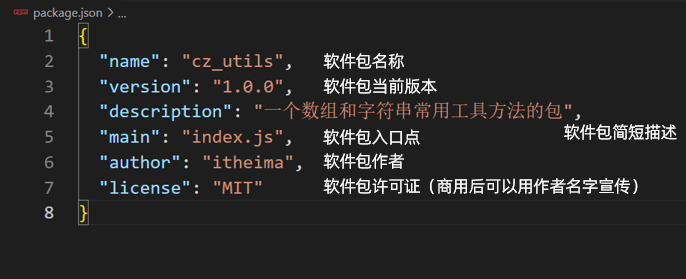
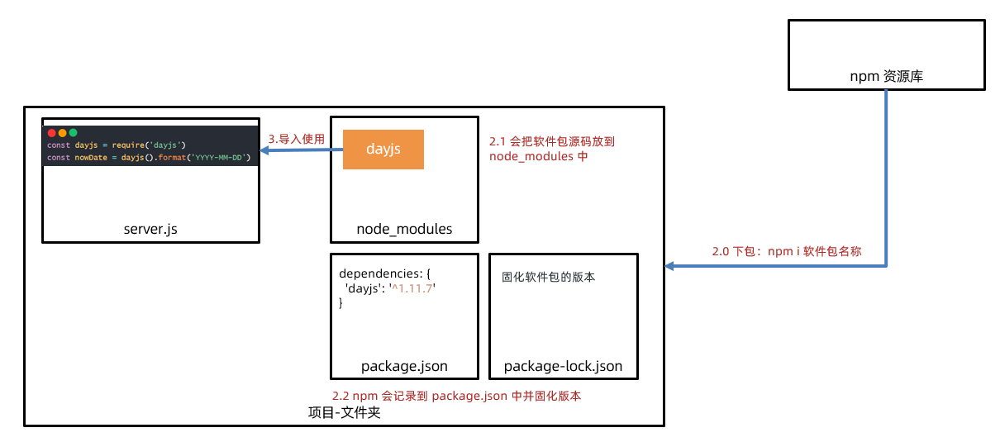

# Day02_Node.js模块化

## 知识点自测

1. 以下代码运行的结果是多少？

   ```js
   const arr = [10, 20, 30]
   const result = arr.map(val => val + 1).reduce((sum, val) => sum += val, 0)
   console.log(result)
   ```

   A：60

   B：63

   <details>
   <summary>答案</summary>
   <ul>
   <li>B选项正确</li>
   </ul>
   </details>


2. 以下代码运行的结果是多少？

   ```js
   const obj = { username: 'itheima', password: '777777' }
   const { uname } = obj
   console.log(uname)
   ```

   A：itheima

   B：undefined

   <details>
   <summary>答案</summary>
   <ul>
   <li>B选项正确</li>
   </ul>
   </details>


## 目录

* Node.js 模块化
* 软件包
* npm 软件包管理器
* npm 全局软件包
* Express 搭建 Web 服务
* 案例 - 接口开发
* 跨域以及解决方案


## 学习目标

1. 了解 Node.js 模块化的概念和好处
2. 了解 Node.js 中软件包的概念和引入
3. 掌握 Node.js 的 npm 软件包管理器使用
4. 了解 Node.js 中本地软件包与全局软件包区别
5. 了解 基于 Express 搭建 Web 服务
6. 掌握同源策略和跨域概念，以及开发环境和生产环境的解决方案


## 01.模块化简介

### 目标

了解模块化概念和好处，以及 CommonJS 标准语法导出和导入


### 讲解

1. 在 Node.js 中每个文件都被当做是一个独立的模块，模块内定义的变量和函数都是独立作用域的，因为 Node.js 在执行模块代码时，将使用如下所示的函数封装器对其进行封装

   

​	

2. 而且项目是由多个模块组成的，每个模块之间都是独立的，而且提高模块代码复用性，按需加载，独立作用域

   

3. 但是因为模块内的属性和函数都是私有的，如果对外使用，需要使用标准语法导出和导入才可以，而这个标准叫 CommonJS 标准，接下来我们在一个需求中，体验下模块化导出和导入语法的使用

4. 需求：定义 utils.js 模块，封装基地址和求数组总和的函数，导入到 index.js 使用查看效果

   

5. 导出语法：

   ```js
   module.exports = {
     对外属性名: 模块内私有变量
   }
   ```

6. 导入语法：

   ```js
   const 变量名 = require('模块名或路径')
   // Node.js 环境内置模块直接写模块名（例如：fs，path，http）
   // 自定义模块：写模块文件路径（例如：./utils.js)
   ```

   > 变量名的值接收的就是目标模块导出的对象

7. 代码实现

   * utils.js：导出

     ```js
     /**
      * 目标：基于 CommonJS 标准语法，封装属性和方法并导出
      */
     const baseURL = 'http://hmajax.itheima.net'
     const getArraySum = arr => arr.reduce((sum, item) => sum += item, 0)
     
     // 导出
     module.exports = {
       url: baseURL,
       arraySum: getArraySum
     }
     ```

   * index.js：导入使用

     ```js
     /**
      * 目标：基于 CommonJS 标准语法，导入工具属性和方法使用
      */
     // 导入
     const obj = require('./utils.js')
     console.log(obj)
     const result = obj.arraySum([5, 1, 2, 3])
     console.log(result)
     ```

     

### 小结

1. Node.js 中什么是模块化?

   <details>
   <summary>答案</summary>
   <ul>
   <li>每个文件都是独立的模块</li>
   </ul>
   </details>

2. 模块之间如何联系呢?

   <details>
   <summary>答案</summary>
   <ul>
   <li>使用特定语法，导出和导入使用</li>
   </ul>
   </details>

3. CommonJS 标准规定如何导出和导入模块?

   <details>
   <summary>答案</summary>
   <ul>
   <li>导出：module.exports = {},导入：require('模块名或路径')</li>
   </ul>
   </details>

4. 模块名/路径如何选择?

   <details>
   <summary>答案</summary>
   <ul>
   <li>内置模块：写名字。例如：fs，path，http等。自定义模块：写模块文件路径，例如：./utils.js</li>
   </ul>
   </details>


## 02.ECMAScript标准-默认导出和导入

### 目标

掌握 ECMAScript 标准语法中，默认导出和导入的使用


### 讲解

1. CommonJS 规范是 Node.js 环境中默认的，后来官方推出 ECMAScript 标准语法，我们接下来在一个需求中，体验下这个标准中默认导出和导入的语法要如何使用

1. 需求：封装并导出基地址和求数组元素和的函数，导入到 index.js 使用查看效果

1. 导出语法：

   ```js
   export default {
     对外属性名: 模块内私有变量
   }
   ```

1. 导入语法：

   ```js
   import 变量名 from '模块名或路径'
   ```
   
   > 变量名的值接收的就是目标模块导出的对象


5. 注意：Node.js 默认只支持 CommonJS 标准语法，如果想要在当前项目环境下使用 ECMAScript 标准语法，请新建 package.json 文件设置 type: 'module' 来进行设置

   ```json
   { “type”: "module" }
   ```


6. 代码实现：

   * utils.js：导出

     ```js
     /**
      * 目标：基于 ECMAScript 标准语法，封装属性和方法并"默认"导出
      */
     const baseURL = 'http://hmajax.itheima.net'
     const getArraySum = arr => arr.reduce((sum, item) => sum += item, 0)
     
     // 默认导出
     export default {
       url: baseURL,
       arraySum: getArraySum
     }
     ```

   * index.js：导入

     ```js
     /**
      * 目标：基于 ECMAScript 标准语法，"默认"导入，工具属性和方法使用
      */
     // 默认导入
     import obj from './utils.js'
     console.log(obj)
     const result = obj.arraySum([10, 20, 30])
     console.log(result)
     ```


### 小结

1. ECMAScript 标准规定如何默认导出和导入模块?

   <details>
   <summary>答案</summary>
   <ul>
   <li>导出：export default {} 导入：import 变量名 from '模块名或路径'</li>
   </ul>
   </details>

2. 如何让 Node.js 切换模块标准为 ECMAScript？

   <details>
   <summary>答案</summary>
   <ul>
   <li>运行模块所在文件夹，新建 package.json 并设置 {“type”：“module”}</li>
   </ul>
   </details>


## 03.ECMAScript标准-命名导出和导入

### 目标

掌握 ECMAScript 标准语法中，命名导出和导入的使用


### 讲解

1. ECMAScript 标准的语法有很多，常用的就是默认和命名导出和导入，这节课我们来学习下命名导出和导入的使用

2. 需求：封装并导出基地址和数组求和函数，导入到 index.js 使用查看效果

3. 命名导出语法：

   ```js
   export 修饰定义语句
   ```

4. 命名导入语法：

   ```js
   import { 同名变量 } from '模块名或路径'
   ```

   > 注意：同名变量指的是模块内导出的变量名

5. 代码示例：

   * utils.js 导出

     ```js
     /**
      * 目标：基于 ECMAScript 标准语法，封装属性和方法并"命名"导出
      */
     export const baseURL = 'http://hmajax.itheima.net'
     export const getArraySum = arr => arr.reduce((sum, item) => sum += item, 0)
     
     ```

   * index.js 导入

     ```js
     /**
      * 目标：基于 ECMAScript 标准语法，"命名"导入，工具属性和方法使用
      */
     // 命名导入
     import {baseURL, getArraySum} from './utils.js'
     console.log(obj)
     console.log(baseURL)
     console.log(getArraySum)
     const result = getArraySum([10, 21, 33])
     console.log(result)
     ```

6. 与默认导出如何选择：

   * 按需加载，使用命名导出和导入
   * 全部加载，使用默认导出和导入


### 小结

1. Node.js 支持哪 2 种模块化标准?

   <details>
   <summary>答案</summary>
   <ul>
   <li>CommonJS 标准语法（默认）</li>
   <li>ECMAScript 标准语法</li>
   </ul>
   </details>

2. ECMAScript 标准，命名导出和导入的语法?

   <details>
   <summary>答案</summary>
   <ul>
   <li>导出：export 修饰定义的语句，import { 同名变量 } from '模块名或路径'</li>
   </ul>
   </details>

3. ECMAScript 标准，默认导出和导入的语法？

   <details>
   <summary>答案</summary>
   <ul>
   <li>导出：export default {} 导入：import 变量名 from '模块名或路径'</li>
   </ul>
   </details>


## 04.包的概念

### 目标

了解 Node.js 环境中包的概念


### 讲解

1. 包：将模块，代码，其他资料整合成一个文件夹，这个文件夹就叫包

2. 包分类：

   * 项目包：主要用于编写项目和业务逻辑
   * 软件包：封装工具和方法进行使用

3. 包要求：根目录中，必须有 package.json 文件（记录包的清单信息）

   

   

4. 包使用：在引入一个包文件夹到代码中，默认引入的是包文件节下的 index.js 模块文件里导出的对象，如果没有 index.js 文件，则会引入 package.json 里 main 属性指定的文件模块导出的对象

5. 需求：封装数组求和函数的模块，封装判断用户名和密码长度函数的模块，形成一个软件包，并导入到 index.js 中使用查看效果

6. 代码示例：

   * utils/lib 相关代码在素材里准备好了，只需要自己在 utils/index.js 统一出口进行导出

     ```js
     /**
      * 本文件是，utils 工具包的唯一出口
      * 作用：把所有工具模块方法集中起来，统一向外暴露
      */
     const { getArraySum } = require('./lib/arr.js')
     const { checkUser, checkPwd } = require('./lib/str.js')
     
     // 统一导出所有函数
     module.exports = {
       getArraySum,
       checkUser,
       checkPwd
     }
     
     ```

   * index.js 导入软件包文件夹使用（注意：这次导入的是包文件夹，不是模块文件）

     ```js
     /**
      * 目标：导入 utils 软件包，使用里面封装的工具函数
      */
     const obj = require('./utils')
     console.log(obj)
     const result = obj.getArraySum([10, 20, 30])
     console.log(result)
     ```

     


### 小结

1. 什么是包?

   <details>
   <summary>答案</summary>
   <ul>
   <li>将模块，代码，其他资料聚合成的文件夹</li>
   </ul>
   </details>

2. 包分为哪 2 类呢?

   <details>
   <summary>答案</summary>
   <ul>
   <li>项目包：编写项目代码的文件夹，软件包：封装工具和方法供开发者使用</li>
   </ul>
   </details>

3. package.json 文件的作用?

   <details>
   <summary>答案</summary>
   <ul>
   <li>记录软件包的名字，作者，入口文件等信息</li>
   </ul>
   </details>

4. 导入一个包文件夹的时候，导入的是哪个文件?

   <details>
   <summary>答案</summary>
   <ul>
   <li>默认 index.js 文件，或者 main 属性指定的文件</li>
   </ul>
   </details>


## 05.npm软件包管理器

### 目标

掌握使用 npm 管理软件包


### 讲解

1. npm 简介[链接]([http://dev.nodejs.cn/learn/an-introduction-to-the-npm-package-manager#npm-%E7%AE%80%E4%BB%8B](http://dev.nodejs.cn/learn/an-introduction-to-the-npm-package-manager))： 软件包管理器，用于下载和管理 Node.js 环境中的软件包

   

2. npm 使用步骤：

   1. 初始化清单文件： npm init -y （得到 package.json 文件，有则跳过此命令）

      > 注意 -y 就是所有选项用默认值，所在文件夹不要有中文/特殊符号，建议英文和数字组成，因为 npm 包名限制建议用英文和数字或者下划线中划线

   2. 下载软件包：npm i 软件包名称

   3. 使用软件包

3. 需求：使用 npm 下载 dayjs 软件包到本地项目文件夹中，引入到 index.js 中格式化日期打印，运行观察效果

4. 具体使用流程图：

   


### 小结

1. npm 软件包管理器作用？

   <details>
   <summary>答案</summary>
   <ul>
   <li>下载软件包以及管理版本</li>
   </ul>
   </details>

2. 初始化项目清单文件 package.json 命令?

   <details>
   <summary>答案</summary>
   <ul>
   <li>npm init -y</li>
   </ul>
   </details>

3. 下载软件包的命令？

   <details>
   <summary>答案</summary>
   <ul>
   <li>npm i 软件包名字</li>
   </ul>
   </details>

4. 下载的包会存放在哪里?

   <details>
   <summary>答案</summary>
   <ul>
   <li>当前项目下的 node_modules 中，并记录在 package.json 中</li>
   </ul>
   </details>


## 06.npm安装所有依赖

### 目标

掌握 npm 安装所有依赖功能


### 讲解

1. 我们拿到了一个别人编写的项目，但是没有 node_modules，项目能否正确运行？

   > 不能，因为缺少了项目需要的依赖软件包，比如要使用 dayjs 和 lodash 但是你项目里没有这个对应的源码，项目会报错的

   
   
1. 为何没有给我 node_modules？

   > 因为每个人在自己的本机使用 npm 下载，要比磁盘间传递要快（npm 有缓存在本机）

1. 如何得到需要的所有依赖软件包呢？

   > 直接在项目目录下，运行终端命令：npm i 即可安装 package.json 里记录的所有包和对应版本到本项目中的 node_modules

   
   


4. 需求：请在准备好的素材项目中，安装项目所有需要的依赖软件包，并运行 index.js 代码看是否正常！


### 小结

1. 当前项目中只有 package.json 没有 node_modules 怎么办?

   <details>
   <summary>答案</summary>
   <ul>
   <li>当前项目目录下，打开终端，执行 npm i 安装所有依赖软件包</li>
   </ul>
   </details>

2. 为什么 node_modules 不进行传递?

   <details>
   <summary>答案</summary>
   <ul>
   <li>因为用 npm 下载有缓存在本机，比磁盘之间传递要快</li>
   </ul>
   </details>


## 07.npm全局软件包-nodemon

### 目标

掌握本地软件包和全局软件包区别，体验 nodemon 的使用


### 讲解

1. 软件包区别：
   * 本地软件包：当前项目内使用，<span style="color: red;">封装属性和方法</span>，存在于 node_modules
   * 全局软件包：本机所有项目使用，<span style="color: red;">封装命令和工具</span>，存在于系统设置的位置


2. nodemon 作用：替代 node 命令，检测代码更改，自动重启程序
3. 使用：
   1. 安装：npm i nodemon -g （-g 代表安装到全局环境中）
   2. 运行：nodemon 待执行的目标 js 文件
4. 需求：使用 nodemon 命令来启动素材里准备好的项目，然后修改代码保存后，观察终端重启应用程序


### 小结

1. 本地软件包和全局软件包区别?

   <details>
   <summary>答案</summary>
   <ul>
   <li>本地软件包，作用在当前项目，封装属性和方法</li>
   <li>全局软件包，本地所有项目使用，封装命令和工具</li>
   </ul>
   </details>

2. nodemon 作用?

   <details>
   <summary>答案</summary>
   <ul>
   <li>替代 node 命令，检测代码更改，自动重启程序</li>
   </ul>
   </details>

3. nodemon 怎么用?

   <details>
   <summary>答案</summary>
   <ul>
   <li>先确保安装 npm i nodemon -g</li>
   <li>使用 nodemon 执行目标 js 文件</li>
   </ul>
   </details>


## 08.Node.js概念和常用命令总结

### 目标

把上面学的模块化语法，包的概念，常用命令进行总结


### 讲解

1. Node.js 模块化：把每个文件当做一个模块，独立作用域，按需加载，使用特定标准语法导出和导入使用

   > CommonJS 标准：一般应用在 Node.js 项目环境中
   >
   > ECMAScript 标准：一般应用在前端工程化项目中

   

   


2. Node.js 包：把模块文件，代码文件，其他资料聚合成一个文件夹就是包

   > 项目包：编写项目需求和业务逻辑的文件夹
   >
   > 软件包：封装工具和方法进行使用的文件夹（一般使用 npm 管理）
   >
   > * 本地软件包：作用在当前项目，封装的属性/方法，供项目调用编写业务需求
   > * 全局软件包：作用在所有项目，一般封装的命令/工具，支撑项目运行

   


3. Node.js 常用命令：

   


### 小结

1. 安装本地软件包的命令是什么？

   <details>
   <summary>答案</summary>
   <ul>
   <li>npm i 软件包名</li>
   </ul>
   </details>


## 09.Express快速搭建 Web 服务

### 目标

基于 express 本地软件包，快速搭建 Web 服务


### 讲解

1. Express定义[链接](https://www.expressjs.com.cn/): 基于 Node.js 平台，快速，开放，极简的 Web 开发框架

   

2. 概念：使用 express 本地软件包，快速搭建 Web 服务（基于 http 模块）

3. 功能：开发 Web 服务，提供数据接口，提供网页资源供浏览器使用

4. 需求：基于 express 编写 Web 服务，对 get 请求方法和 / 路径监听，有人请求返回一段提示字符串

5. 使用：

   1. 下载 express 本地软件包到项目中

   2. 导入 express 创建 Web 服务对象

   3. 监听请求方法和请求路径，返回一段提示字符串

   4. 对其他请求方法和请求路径，默认返回 404 提示

   5. 监听端口号，启动 Web 服务，在浏览器请求测试

6. 代码如下：

   ```js
   /**
    * 目标：基于 express 本地软件包，开发 Web 服务，返回资源给请求方
    */
   // 1. 下载 express 软件包
   // 2. 导入并创建 Web 服务对象
   const express = require('express')
   const server = express()
   
   // 3. 监听请求的方法和请求的资源路径
   server.get('/', (req, res) => {
     res.send('你好，欢迎使用 Express')
   })
   
   // 4. 监听任意请求的方法和请求的资源路径
   server.all('*', (req, res) => {
     res.status(404)
     res.send('你要访问的资源路径不存在')
   })
   
   // 5. 监听端口号，启动 Web 服务
   server.listen(3000, () => {
     console.log('Web 服务已启动')
   })
   ```

   


### 小结

1. express 软件包作用?

   <details>
   <summary>答案</summary>
   <ul>
   <li>基于 Node.js 快速搭建 Web 服务，提供数据接口和网页资源访问</li>
   </ul>
   </details>


## 10.案例-获取省份列表接口

### 目标

基于 express 的 Web 服务，编写提供省份列表数据的接口


### 讲解

1. 需求：基于 express，开发提供省份列表数据的接口

1. 步骤：监听 get 请求方法的 /api/province 路径，并读取 province.json 里省份数据返回给请求方

   


3. 核心代码：

   ```js
   // 监听 get 请求方法，监听资源路径 /api/province，就读取 province.json 省份数据返回
   server.get('/api/province', (req, res) => {
     fs.readFile(path.join(__dirname, 'data/province.json'), (err, data) => {
       res.send(data.toString())
     })
   })
   ```


### 小结

1. express 创建的 Web 服务对象，如何监听前端的请求方法?

   <details>
   <summary>答案</summary>
   <ul>
   <li>调用与请求方式同名的方法即可，参数一传入要监听的请求资源路径，命中后才执行后续的回调函数</li>
   </ul>
   </details>


## 11.浏览器的同源策略

### 目标

掌握同源策略的概念和作用，以及同源策略对 AJAX 的限制


### 讲解

1. 同源策略：它限制一个源的文档或者加载的 JS 脚本，与另外一个源的资源进行交互，帮助我们阻隔恶意文档，减少被攻击的媒介

2. 例如：被钓鱼网站收集信息，用 AJAX 发起恶意请求，传递转账信息到银行服务器（跨站伪造请求攻击）

   


3. 源指的是：协议，域名，端口号的组成

   

4. 同源：网页加载时所在源，和 AJAX 请求时的源（协议，域名，端口号）全部相同即为同源，所以刚刚的例子并不是同源访问，他们的域名是不同的

   

5. 作用：浏览器的同源策略，保护浏览器中网站的安全，限制 AJAX 只能向同源 URL 发起请求


### 小结

1. 什么是同源策略？

   <details>
   <summary>答案</summary>
   <ul>
   <li>限制一个源对另外一个源资源交互</li>
   </ul>
   </details>

2. 同源策略限制的是?

   <details>
   <summary>答案</summary>
   <ul>
   <li>限制 AJAX 只能访问同源 URL</li>
   </ul>
   </details>

3. 什么情况下是同源？

   <details>
   <summary>答案</summary>
   <ul>
   <li>网页加载时所在的源，和 AJAX 请求时的源（协议，域名，端口号）全部相同即为同源</li>
   </ul>
   </details>


## 12.跨域问题

### 目标

掌握跨域的概念，以及出现跨域的问题


### 讲解

1. 跨域：从一个源的文档/脚本，加载另一个源的资源产生了跨域

2. 例如：网页文档打开时所在源和 AJAX 访问的源（协议，域名，端口）有一个不同，就发生了跨域访问

   

3. 网页出现跨域访问时，会在浏览器控制里报错如下：

   > Access to XMLHttpRequest 意思为：XHR 链接出了问题，从一个源（http://localhost:5500 跨域访问 http://localhost:3000）

   

4. 需求：在 LiveServer 的 Web 服务启动网页，用 AJAX 访问本机 Web 服务提供的省份列表接口，体验下跨域问题，index.html 代码如下：

   ```js
   // 目标：请求本机 Web 服务提供的省份列表数据
   axios({
     url: 'http://localhost:3000/api/province',
     // method: 'get'
   }).then(res => {
     console.log(res)
   }).catch(err => {
     console.log(err)
   })
   ```

   


### 小结

1. 什么是跨域访问?

   <details>
   <summary>答案</summary>
   <ul>
   <li>网页所在源和 AJAX 请求的源（协议，域名，端口号）不完全相同，就发生跨域访问</li>
   </ul>
   </details>


## 13.跨域问题-解决方案1-CORS

### 目标

掌握开发环境下，跨域问题解决方案 CORS


### 讲解

1. 目标：前后端分离的项目，前端和后端不在一个源，还要保证数据通信

2. 解决：采用 CORS （跨域资源共享），一种基于 HTTP 头的机制，该机制通过允许服务器标示除了它自己以外的其他源（域、协议或端口），来访问加载服务器上的资源

   


3. 思路：
   * 服务器端：设置 Access-Control-Allow-Origin 响应头字段，允许除了它自己以外的源来访问自己的资源
   * 前端：正常发起 AJAX 请求，无需额外操作
4. 步骤：
   1. 下载 cors 本地软件包
   2. 导入 cors 函数
   3. 使用 server.use() 给 Web 服务添加插件功能
   4. 把 cors 函数调用传入给 Web 服务，启动测试


5. 设置响应头代码

   ```js
   // 2. 导入 cors 函数
   const cors = require('cors')
   // 3. 使用 server.use() 给 Web 服务添加插件功能
   server.use(cors())
   ```

   


### 小结

1. 为什么要解决跨域问题?

   <details>
   <summary>答案</summary>
   <ul>
   <li>因为前后端分离的项目，不在同一个源去开发项目，需要保证数据之间通信</li>
   </ul>
   </details>

2. 跨域问题如何解决?

   <details>
   <summary>答案</summary>
   <ul>
   <li>让后端开启 CORS 跨域资源共享，在响应头设置 Access-Control-Allow-Origin: '*'</li>
   </ul>
   </details>


## 14.跨域问题-解决方案2-同源访问

### 目标

掌握生产环境下，跨域问题解决方案，同源访问


### 讲解

1. 目标：开发环境用 cors，上线部署关闭 cors，并采用同源访问方式
   
1. 做法：让后端 Web 服务即可以提供数据接口，也可以返回网页资源
   
1. 好处：安全，后端的接口不允许非同源来访问
   
   
   


4. 代码：express 设置暴露 public 文件夹作为静态资源目录，供浏览器直接访问，可以访问里面的 html 网页

   ```js
   // 暴露指定的文件夹，让前端可以直接拼接路径和资源名字来访问
   server.use(express.static(path.join(__dirname, 'public')))
   ```

   

### 小结

1. CORS 只适用于什么阶段的项目?

   <details>
   <summary>答案</summary>
   <ul>
   <li>本地开发阶段项目</li>
   </ul>
   </details>

2. 项目上线，如何解决跨域问题?

   <details>
   <summary>答案</summary>
   <ul>
   <li>把前端项目和后端项目部署到同一个源下访问</li>
   </ul>
   </details>


## 今日重点（必须会）

1. ECMAScript 标准语法的使用（包括默认导出和导入，以及按需导出和导入）
2. 加载包文件夹的时候，加载的是什么文件
3. npm 软件包管理器相关命令和作用
4. 浏览器的同源策略概念，以及跨域问题解决方案


## 今日作业（必完成）

参考配套文件夹里<作业>里的md要求


## 参考文档

1. [package.json - 更多属性含义](http://nodejs.cn/learn/the-package-json-guide)
2. [开源许可 - 更多资料](https://blog.csdn.net/zlzbt/article/details/122438057)
3. [开源许可 - 更多资料2](https://www.jianshu.com/p/23e61804d81e)
4. [更多 npm 命令](https://www.npmjs.cn/)
5. [export导出-更多学习](https://developer.mozilla.org/zh-CN/docs/Web/JavaScript/Reference/Statements/export)
6. [import导入-更多学习](https://developer.mozilla.org/zh-CN/docs/Web/JavaScript/Reference/Statements/import)
7. [同源策略](https://developer.mozilla.org/zh-CN/docs/Web/Security/Same-origin_policy)
8. [跨域资源共享CORS](https://developer.mozilla.org/zh-CN/docs/Web/HTTP/CORS)

