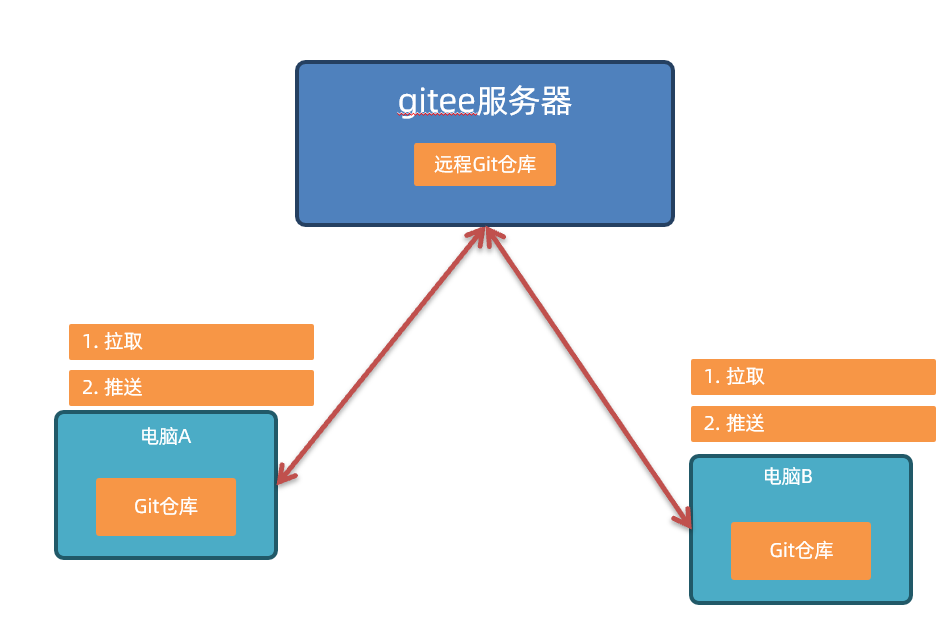
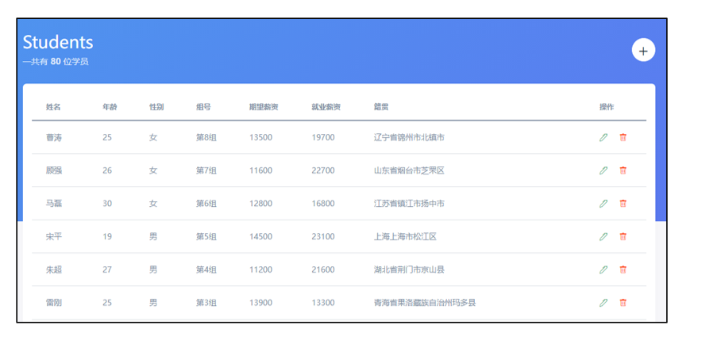
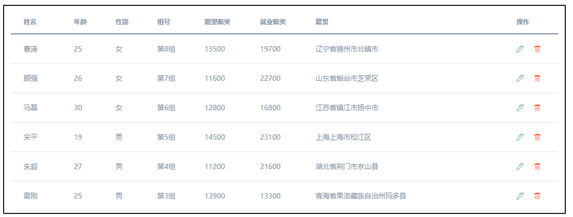
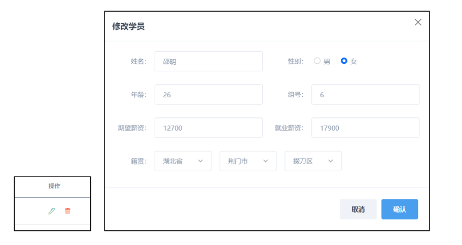
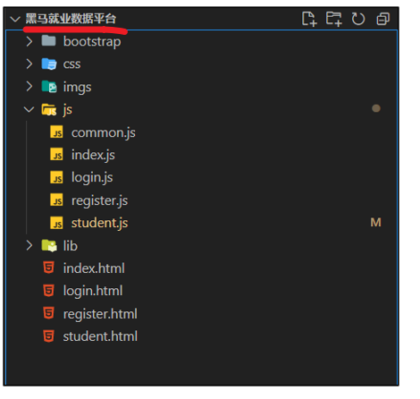
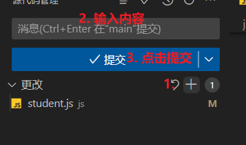
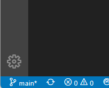
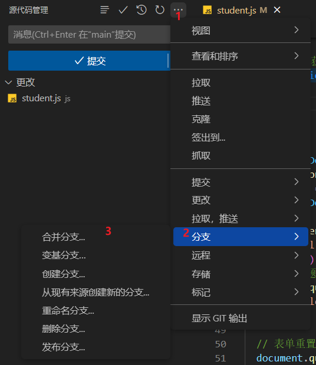

# Git&黑马就业数据平台-day04


## 数据看板-籍贯分布

> 数据看板-籍贯分布

**需求:**


**核心步骤:**

1. 更为复杂的图形**去社区**找
   1. echarts社区：https://www.makeapie.cn/echarts
   2. 社区模板代码地址：https://www.makeapie.cn/echarts_content/xr1W9m5LOG.html
2. 整合到项目
3. 调整设置
   1. 服务器返回的是部分数据（value不为0）
   2. 循环本地数据，去服务器返回的数据中检索
   3. 找到之后将`value`设置给**对应**的数据即可


**调整好的基础模板:**

1. **移除了随机数据和多余设置**的基础代码，直接CV

```javascript
 function renderProvince(provinceData){
  const dom = document.querySelector('#map')
  const myEchart = echarts.init(dom)
  const dataList = [
    { name: '南海诸岛', value: 0 },
    { name: '北京', value: 0 },
    { name: '天津', value: 0 },
    { name: '上海', value: 0 },
    { name: '重庆', value: 0 },
    { name: '河北', value: 0 },
    { name: '河南', value: 0 },
    { name: '云南', value: 0 },
    { name: '辽宁', value: 0 },
    { name: '黑龙江', value: 0 },
    { name: '湖南', value: 0 },
    { name: '安徽', value: 0 },
    { name: '山东', value: 0 },
    { name: '新疆', value: 0 },
    { name: '江苏', value: 0 },
    { name: '浙江', value: 0 },
    { name: '江西', value: 0 },
    { name: '湖北', value: 0 },
    { name: '广西', value: 0 },
    { name: '甘肃', value: 0 },
    { name: '山西', value: 0 },
    { name: '内蒙古', value: 0 },
    { name: '陕西', value: 0 },
    { name: '吉林', value: 0 },
    { name: '福建', value: 0 },
    { name: '贵州', value: 0 },
    { name: '广东', value: 0 },
    { name: '青海', value: 0 },
    { name: '西藏', value: 0 },
    { name: '四川', value: 0 },
    { name: '宁夏', value: 0 },
    { name: '海南', value: 0 },
    { name: '台湾', value: 0 },
    { name: '香港', value: 0 },
    { name: '澳门', value: 0 },
  ]
  const option = {
    title: {
      text: '籍贯分布',
      top: 10,
      left: 10,
      textStyle: {
        fontSize: 16,
      },
    },
    tooltip: {
      trigger: 'item',
      formatter: '{b}: {c} 位学员',
      borderColor: 'transparent',
      backgroundColor: 'rgba(0,0,0,0.5)',
      textStyle: {
        color: '#fff',
      },
    },
    visualMap: {
      min: 0,
      max: 6,
      left: 'left',
      bottom: '20',
      text: ['6', '0'],
      inRange: {
        color: ['#ffffff', '#0075F0'],
      },
      show: true,
      left: 40,
    },
    geo: {
      map: 'china',
      roam: false,
      zoom: 1.0,
      label: {
        normal: {
          show: true,
          fontSize: '10',
          color: 'rgba(0,0,0,0.7)',
        },
      },
      itemStyle: {
        normal: {
          borderColor: 'rgba(0, 0, 0, 0.2)',
          color: '#e0ffff',
        },
        emphasis: {
          areaColor: '#34D39A',
          shadowOffsetX: 0,
          shadowOffsetY: 0,
          shadowBlur: 20,
          borderWidth: 0,
          shadowColor: 'rgba(0, 0, 0, 0.5)',
        },
      },
    },
    series: [
      {
        name: '籍贯分布',
        type: 'map',
        geoIndex: 0,
        data: dataList,
      },
    ],
  }
  myEchart.setOption(option)
}


```

**关键代码:**

1. `index.js`

```javascript
// 渲染籍贯分布
function renderProvince(provinceData) {
  // console.log(provinceData)
  const dom = document.querySelector('#map')
  const myEchart = echarts.init(dom)
  const dataList = [
    { name: '南海诸岛', value: 0 },
    { name: '北京', value: 0 },
    { name: '天津', value: 0 },
    { name: '上海', value: 0 },
    { name: '重庆', value: 0 },
    { name: '河北', value: 0 },
    { name: '河南', value: 0 },
    { name: '云南', value: 0 },
    { name: '辽宁', value: 0 },
    { name: '黑龙江', value: 0 },
    { name: '湖南', value: 0 },
    { name: '安徽', value: 0 },
    { name: '山东', value: 0 },
    { name: '新疆', value: 0 },
    { name: '江苏', value: 0 },
    { name: '浙江', value: 0 },
    { name: '江西', value: 0 },
    { name: '湖北', value: 0 },
    { name: '广西', value: 0 },
    { name: '甘肃', value: 0 },
    { name: '山西', value: 0 },
    { name: '内蒙古', value: 0 },
    { name: '陕西', value: 0 },
    { name: '吉林', value: 0 },
    { name: '福建', value: 0 },
    { name: '贵州', value: 0 },
    { name: '广东', value: 0 },
    { name: '青海', value: 0 },
    { name: '西藏', value: 0 },
    { name: '四川', value: 0 },
    { name: '宁夏', value: 0 },
    { name: '海南', value: 0 },
    { name: '台湾', value: 0 },
    { name: '香港', value: 0 },
    { name: '澳门', value: 0 },
  ]

  // 筛选数据
  dataList.forEach(item => {
    const res = provinceData.find(v => {
      return v.name.includes(item.name)
    })
    // console.log(res)
    // 数据赋值
    if (res !== undefined) {
      item.value = res.value
    }
  })
  // console.log(dataList)

  const option = {
    title: {
      text: '籍贯分布',
      top: 10,
      left: 10,
      textStyle: {
        fontSize: 16,
      },
    },
    tooltip: {
      trigger: 'item',
      formatter: '{b}: {c} 位学员',
      borderColor: 'transparent',
      backgroundColor: 'rgba(0,0,0,0.5)',
      textStyle: {
        color: '#fff',
      },
    },
    visualMap: {
      min: 0,
      max: 6,
      left: 'left',
      bottom: '20',
      text: ['6', '0'],
      inRange: {
        color: ['#ffffff', '#0075F0'],
      },
      show: true,
      left: 40,
    },
    geo: {
      map: 'china',
      roam: false,
      zoom: 1.0,
      label: {
        normal: {
          show: true,
          fontSize: '10',
          color: 'rgba(0,0,0,0.7)',
        },
      },
      itemStyle: {
        normal: {
          borderColor: 'rgba(0, 0, 0, 0.2)',
          color: '#e0ffff',
        },
        emphasis: {
          areaColor: '#34D39A',
          shadowOffsetX: 0,
          shadowOffsetY: 0,
          shadowBlur: 20,
          borderWidth: 0,
          shadowColor: 'rgba(0, 0, 0, 0.5)',
        },
      },
    },
    series: [
      {
        name: '籍贯分布',
        type: 'map',
        geoIndex: 0,
        data: dataList,
      },
    ],
  }
  myEchart.setOption(option)
}


// 首页-统计数据
async function getData() {

  // 使用拦截器的写法（只保留核心逻辑即可）
  const res = await axios({
    url: '/dashboard',
  })
  // const overview = res.data.overview
  // 通过解构语法，简化数据取值
  // console.log(res)
  const { overview, year, salaryData, groupData, provinceData } = res.data

  // 调用函数-渲染顶部数据
  renderOverview(overview)

  // 调用函数-渲染薪资走势
  renderYearSalary(year)
    
  // 调用函数-渲染薪资分布
  renderSalary(salaryData)
    
  // 调用函数-渲染每组薪资
  renderGroupSalary(groupData)
    
  // 调用函数-渲染男女薪资分布
  renderGenderSalary(salaryData)
    
  // 调用函数-渲染籍贯分布
  renderProvince(provinceData)
}

```


**git记录:**

```bash
git add .
git commit -m"数据看板-籍贯分布"
```

## 数据看板-代码上传

> 将代码同步到服务器

**需求:**

1. 将代码上传到**gitee**

**核心步骤:**

1. 拉取（确保进度一致）
2. 推送

```bash
git pull
git push
```





## 信息管理-公共逻辑整合

> 整合`common.js`中的公共逻辑

**需求:**

1. 整合抽取的公共逻辑（登录校验、渲染用户名、退出登录）

**核心步骤:**

1. 整合`common.js`中的函数到`student.js`即可


**关键代码:**

1. `student.js`

```javascript
// 整合函数-登录校验
checkLogin()

// 整合函数-渲染用户名
renderUsername()

// 整合函数-退出登录逻辑
registerLogout()

```


**git记录:**

```bash
git add .
git commit -m"信息管理-公共逻辑整合"
```


## 信息管理-学员信息渲染

> 接下来完成，学员信息渲染

**需求:**

1. 页面打开，获取+渲染数据



**核心步骤:**

1. 抽取函数

2. 获取数据

   1. 补充一个`axios`的别名方法

   ```javascript
   // get请求
   // 参数1 url地址
   // 参数2 以对象的形式调整设置
   axios.get(url, {
     // 查询参数
     params:{}
   })
   
   ```

3. 渲染数据

   1. 保存学员id方便后续**删除和编辑**使用


**关键代码:**

```javascript
// 抽取函数-获取学员数据
async function getData() {
  // 获取数据
  const res = await axios.get('/students')
  // console.log(res)
  // 渲染数据
  const html = res.data.map(v => {
    const { name, age, gender, group, hope_salary, salary, province, city, area, id } = v
    return `
    <tr>
        <td>${name}</td>
        <td>${age}</td>
        <td>${gender === 0 ? '男' : '女'}</td>
        <td>第${group}组</td>
        <td>${hope_salary}</td>
        <td>${salary}</td>
        <td>${province + city + area}</td>
        <td data-id="${id}">
          <a href="javascript:;" class="text-success mr-3"><i class="bi bi-pen"></i></a>
          <a href="javascript:;" class="text-danger"><i class="bi bi-trash"></i></a>
        </td>
      </tr>
    `
  }).join('')

  document.querySelector('.list').innerHTML = html

  document.querySelector('.total').innerText = res.data.length
}

getData()
```


**git记录:**

```bash
git add .
git commit -m"信息管理-学员信息渲染"
```


## 信息管理-新增学员

> 接下来完成新增学员

**需求:**


**核心步骤:**

1. 点击弹框
   1. 实例化Modal
   2. 调用显示方法`show()`
2. 省市区联动
   1. 省数据获取+渲染
   2. 市数据获取+渲染（省select标签的change事件）
   3. 区数据获取+渲染（市select标签的change事件）
3. 数据新增
   1. 函数抽取
   2. 数据收集+转换+提交（插件收集数据、根据文档转换）
      1. 新增成功: 提示用户，关闭弹框，重新获取数据
      2. 新增失败: 提示用户，关闭弹框 

**关键代码:**

1. `student.js`

```javascript
// 显示弹框
const modalDom = document.querySelector('#modal')
const modal = new bootstrap.Modal(modalDom)

document.querySelector('#openModal').addEventListener('click', () => {
  modal.show()
})


// 省市区联动
const proSelect = document.querySelector('[name=province]')
const citySelect = document.querySelector('[name=city]')
const areaSelect = document.querySelector('[name=area]')

async function initSelect() {
  // 省数据获取+渲染
  const proRes = await axios.get('/api/province')
  // console.log(proRes)
  const proHtml = proRes.list.map(v => {
    return `<option value="${v}">${v}</option>`
  }).join('')
  proSelect.innerHTML = `<option value="">--省份--</option>${proHtml}`

  // 市数据获取+渲染
  proSelect.addEventListener('change', async () => {
    const cityRes = await axios.get('/api/city', {
      params: {
        pname: proSelect.value
      }
    })
    const cityHtml = cityRes.list.map(v => {
      return `<option value="${v}">${v}</option>`
    }).join('')
    citySelect.innerHTML = `<option value="">--城市--</option>${cityHtml}`

    // 一会需要清空地区标签的内容，否则会有Bug(停留在上一次的状态)
    areaSelect.innerHTML = `<option value="">--地区--</option>`
  })

  // 区数据获取+渲染
  citySelect.addEventListener('change', async () => {
    const areaRes = await axios.get('/api/area', {
      params: {
        pname: proSelect.value,
        cname: citySelect.value
      }
    })
    const areaHtml = areaRes.list.map(v => {
      return `<option value="${v}">${v}</option>`
    }).join('')
    areaSelect.innerHTML = `<option value="">--地区--</option>${areaHtml}`
  })
}

initSelect()

// 数据新增
document.querySelector('#submit').addEventListener('click', () => {
    // 调用新增学员函数
    addStudent()
})
// 函数抽取-新增学员
async function addStudent() {
  // 数据收集+转换+提交
  const form = document.querySelector('#form')
  const data = serialize(form, { hash: true, empty: true })

  data.age = +data.age
  data.gender = +data.gender
  data.hope_salary = +data.hope_salary
  data.salary = +data.salary
  data.group = +data.group
  // console.log(data)

  try {
    // 新增成功
    const res = await axios.post('/students', data)
    showToast(res.message)
    getData()
  } catch (error) {
    // 新增失败
    // console.dir(error)
    showToast(error.response.data.message)
  }
  modal.hide()


}
```


**git记录:**

```bash
git add .
git commit -m"信息管理-新增学员"
```


## 信息管理-删除数据

> 完成删除数据功能

**需求:**

1. 点击删除，删除对应数据

2. 重新获取最新数据

   

**核心步骤:**

1. 绑定事件（事件委托）

2. 抽取函数（方便管理后续修改的逻辑）

3. 获取id+调用接口（使用渲染时保存的id）

   1. 补充axios的别名方法

   ```javascript
   // 请求方法为delete
   // 参数1 url地址
   axios.delete(url)
   ```

   

4. 重新渲染（调用函数）


**关键代码:**

1. `student.js`

```javascript
// 绑定事件
document.querySelector('.list').addEventListener('click', (e) => {
  // 点了删除标签-调用对应的函数
  if (e.target.classList.contains('bi-trash')) {
    // console.log(e.target.parentNode.parentNode.dataset.id)
    const id = e.target.parentNode.parentNode.dataset.id
    delStudent(id)
  }
})

// 抽取函数-删除数据
async function delStudent(id) {
  // console.log('点了删除')
  // console.log(id)
  // 获取id+调用接口
  await axios.delete(`/students/${id}`)

  // 重新渲染
  getData()
}
```


**git记录:**

```bash
git add .
git commit -m"信息管理-删除数据"
```


## 信息管理-编辑数据

> 接下来完成编辑数据逻辑

**需求:**

1. 点击修改按钮
2. 弹出编辑框并渲染需要修改的数据
3. 修改之后，点击新增能够正常显示（项目共用同一个弹框）



**核心步骤:**

1. 弹出编辑框

   1. 函数抽取
   2. 根据id获取数据
   3. 弹框+数据填充（共用同一个弹框）
      1. 修改标题
      2. 设置输入框
      3. 设置性别
      4. 设置籍贯（省设置value，市和区获取数据+设置value）

2. 保存修改

   1. 函数抽取+调用

      1. 编辑学员函数底部: **弹框Dom元素添加自定义属性**（用来区分新增和修改）

   2. 数据收集+转换+提交

      1. 修改成功: 提示用户，关闭弹框，重新获取数据
      2. 修改失败: 提示用户，关闭弹框

   3. 补充axios的别名方法

      ```javascript
      // 请求方法为put
      // 参数1 url地址
      // 参数2 提交的数据
      axios.put(url,data)
      ```

3. 调整弹框逻辑

   1. 修改标题
   2. 表单重置
   3. 清空籍贯
   4. 删除自定义属性


**关键代码:**

1. `student.js`

```javascript
document.querySelector('#openModal').addEventListener('click', () => {
  // 修改标题
  document.querySelector('.modal-title').innerText = '添加学员'

  // 表单重置
  document.querySelector('#form').reset()

  // 清空籍贯（城市，地区）
  citySelect.innerHTML = '<option value="">--城市--</option>'
  areaSelect.innerHTML = '<option value="">--地区--</option>'

  // 删除自定义属性
  modalDom.dataset.id = ''

  modal.show()
})
// 绑定事件
document.querySelector('.list').addEventListener('click', (e) => {
  // 点了删除标签-调用对应的函数
  if (e.target.classList.contains('bi-trash')) {
    // console.log(e.target.parentNode.parentNode.dataset.id)
    const id = e.target.parentNode.parentNode.dataset.id
    delStudent(id)
  }
  // 点了编辑标签-调用对应的函数
  if (e.target.classList.contains('bi-pen')) {
    const id = e.target.parentNode.parentNode.dataset.id
    editStudent(id)
  }
})

// 抽取函数-编辑学员数据
async function editStudent(id) {
  // console.log('编辑', id)
  const res = await axios.get(`/students/${id}`)

  // 修改标题
  document.querySelector('.modal-title').innerText = '修改学员'

  // 设置输入框(姓名，年龄，组号，期望薪资，就业薪资)
  // 属性名数组
  const keyArr = ['name', 'age', 'group', 'hope_salary', 'salary']
  keyArr.forEach(key => {
    document.querySelector(`[name=${key}]`).value = res.data[key]
  })

  // 设置性别（0 男，1 女）
  const { gender } = res.data
  // 伪数组[男checkbox,女checkbox]
  const chks = document.querySelectorAll('[name=gender]')
  chks[gender].checked = true

  // 设置籍贯
  const { province, city, area } = res.data

  // 设置省（设置select标签的value属性，对应的option会被选中）
  proSelect.value = province

  // 设置市
  const cityRes = await axios.get('/api/city', {
    params: {
      pname: province
    }
  })
  const cityHtml = cityRes.list.map(v => {
    return `<option value="${v}">${v}</option>`
  }).join('')
  citySelect.innerHTML = `<option value="">--城市--</option>${cityHtml}`
  citySelect.value = city

  // 设置区
  const areaRes = await axios.get('/api/area', {
    params: {
      pname: province,
      cname: city
    }
  })
  const areaHtml = areaRes.list.map(v => {
    return `<option value="${v}">${v}</option>`
  }).join('')
  areaSelect.innerHTML = `<option value="">--地区--</option>${areaHtml}`
  areaSelect.value = area

  // 弹框
  modal.show()

  // 保存学员id，用来却分 新增（dataset.id不存在） 编辑（dataset.id有值）
  modalDom.dataset.id = id
}

// 抽取函数-保存修改
async function saveEdit() {
  console.log('保存修改')
  // 数据收集+转换+提交
  const form = document.querySelector('#form')
  const data = serialize(form, { hash: true, empty: true })
  data.age = +data.age
  data.gender = +data.gender
  data.hope_salary = +data.hope_salary
  data.salary = +data.salary
  data.group = +data.group

  try {
    // 修改成功
    const saveRes = await axios.put(`/students/${modalDom.dataset.id}`, data)
    showToast(saveRes.message)
    getData()
  } catch (error) {
    // 修改失败
    // console.dir(error)
    showToast(error.response.data.message)
  }
  modal.hide()
}
```


**git记录:**

```bash
git add .
git commit -m"信息管理-编辑数据"
```


## VSCode的git

> VSCode整合了git功能，可以简化操作

**使用准备:**

1. 使用VSCode直接打开项目，不要额外嵌套文件夹（比如下图）




**使用步骤-本地记录:**

1. 左侧找到第三个选项
2. 点击**更改右侧的+**
3. 输入框输入内容（**记录的信息**）
4. 点击**提交**

```bash
# 等同于如下命令
git add .
git commit -m"记录的信息"
```





**使用步骤-分支记录:**

1. 切换分支: 点击VSCode左下角的 ，根据提示切换分支
   1. 注意:如果没有状态栏，可以通过: **菜单--》查看--》外观--》状态栏**  进行切换



2. 分支合并，删除，合并

   1. 根据下图的顺序依次点击即可找到

   


3. 拉取和推送

   1. 记录完毕之后，点击同步更改接口

   

   


