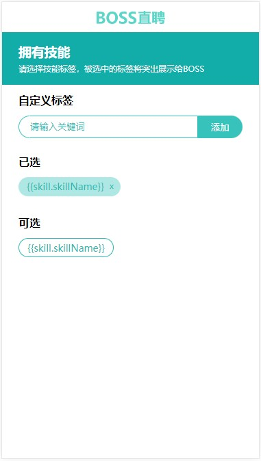
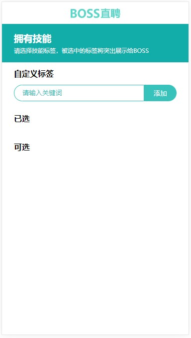

# 今日能力目标：

掌握Vue的基本语法,理解**响应式特性**，能够使用**插值表达式**和**指令**开发页面常见功能

**必要知识：**

1. 能够使用**插值表达式**将变量渲染到页面中
2. 能够使用`v-show`和`v-if`控制元素的显示隐藏，并理解其差异
3. 能够使用`v-on`的简写方式对元素进行事件绑定
4. 能够使用`v-bind`的简写方式对元素进行属性绑定
4. 能够使用`v-for`循环渲染数据
4. 能够使用`v-model`对表单元素进行进行值的绑定

# 一. 编程题

## 1. 哔哩哔哩首页-综合题

**难度等级：**`★★`

**作业目标：**能够完成哔哩哔哩首页的开发

**考察能力：**

1. 能够使用**插值表达式**渲染数据
2. 能够使用`@`的方式对元素进行事件绑定
3. 能够使用`:`的方式对元素进行属性绑定
4. 能够使用`v-for`来循环渲染数据

### 1.1 作业需求

**效果图需求如下：**(请根据提供的数据和模板渲染出所示效果)

 

**具体需求如下：**

1. 频道列表展开收起：点击下拉箭头，**显示**频道列表，点击收起，**隐藏**频道列表

2. 频道渲染：根据提供数据，**循环渲染**出每个频道

3. 播放列表渲染：根据提供数据，**循环渲染**出每个视频的信息


**说明：数据字段对应含义见附件素材的注释**

### 1.2 相关素材

见附件

### 1.3 思路分析

1. 阅读代码：
   - 阅读提供的代码，明确需求
2. 频道列表展开收起：
   - 声明一个变量`showChannelWrap`，用来标识频道的展开收起，默认`false`
   - 通过`v-show`在下拉列表上绑定刚刚声明的`showChannelWrap`
   - 下拉箭头绑定点击事件，点击时`showChannelWrap`置为`true`，显示弹层
   - 收起按钮绑定点击事件，点击时`showChannelWrap`置为`false`，隐藏弹层
3. 频道渲染：
   - 在频道标签上使用`v-for`指令，循环`channelList`，使用插值表达式将内容显示在标签中
   - 绑定`key`属性，值为循环项的索引
4. 播放列表渲染：
   - 在视频卡片模板标签上使用`videoList`，使用插值表达式将内容显示在标签中
   - 绑定`key`属性，值为循环项的索引

### 1.4 参考答案

```html
<!DOCTYPE html>
<html lang="en">

<head>
  <meta charset="UTF-8">
  <meta http-equiv="X-UA-Compatible" content="IE=edge">
  <meta name="viewport" content="width=device-width, initial-scale=1.0">
  <title>bilibili-干杯~~~</title>
  <!-- 引入favicon图标 -->
  <link rel="shortcut icon" href="favicon.ico" type="image/x-icon">
  <!-- 引入css文件 -->
  <link rel="stylesheet" href="./css/index.css">
  <!-- 引入字体图标文件 -->
  <link rel="stylesheet" href="./fonts/iconfont.css">
</head>

<body>
  <div id="app">
    <!-- 头部模块 -->
    <header class="suspension">
      <div class="m-navbar">
        <!-- logo -->
        <a href="#" class="logo">
          <i class="iconfont Navbar_logo"></i>
        </a>
        <!-- 右侧 -->
        <div class="right">
          <a href="#" class="search">
            <i class="iconfont ic_search_tab"></i>
          </a>
          <a href="#" class="face">
            
          </a>
          <div class="app-btn">
            
          </div>
        </div>
      </div>
      <div class="channel-menu">
        <div class="tabs">
          <!-- 很宽的盒子 -->
          <div class="tabs-list">
            <a href="#">首页</a>
            <a href="#">动画</a>
            <a href="#">番剧</a>
            <a href="#">果蔬</a>
            <a href="#">音乐</a>
            <a href="#">舞蹈</a>
            <a href="#">鬼畜</a>
            <a href="#">吹鬼</a>
            <!-- 红色线 -->
            <div class="line"></div>
          </div>
        </div>
        <!-- 下拉箭头 -->
        <div class="after" @click="showChannelWrap=true">
          <i class="iconfont general_pulldown_s"></i>
        </div>
      </div>
    </header>
    <!-- 频道下拉模块 -->
    <div class="tabs-dropdown" v-show="showChannelWrap">
      <div class="tabs-wrap">
        <span v-for="(item,index) in channelList" :key="index">{{item}}</span>
      </div>
      <div class="close-wrap">
        <span @click="showChannelWrap=false">收起︿</span>
      </div>
    </div>
    <!-- 主体部分 -->
    <div class="m-home">
      <div class="video-list">
        <!-- 视频卡片模板 -->
        <a href="#" class="video-item" v-for="(item,index) in videoList" :key="index">
          <div class="card">
            
            <!-- 播放量 -->
            <div class="count">
              <span>
                <i class="iconfont icon_shipin_bofangshu"></i>
                {{item.views}}
              </span>
              <span>
                <i class="iconfont icon_shipin_danmushu"></i>
                {{item.comment}}
              </span>
            </div>
          </div>
          <p class="title ellipsis-2">
            {{item.title}}
          </p>
        </a>
      </div>
    </div>

    <!-- 底部模块 -->
    <footer class="app">
      <div class="btn-app">
        <i class="iconfont Navbar_logo"></i>
        打开App，看你感兴趣的视频
      </div>
    </footer>
  </div>
  <script src="https://cdn.jsdelivr.net/npm/vue@2.7.14/dist/vue.js"></script>
  <script>
    // TODO：阅读代码，根据提供的数据，实现目标效果
    // DATA字段说明
    /**
     *  channelList 频道列表
     *  videoList 视频列表
     *  title 视频标题
     *  views 播放量
     *  commonet 评论量
     *  img 封面图片
    */
    const app = new Vue({
      el: '#app',
      data: {
        channelList: ['首页', '动画', '番剧', '国创', '音乐', '舞蹈', '游戏', '科技', '运动', '汽车', '生活', '美食', '知识', '动物圈', '鬼畜', '时尚娱乐影视', '纪录片', '电影', '电视剧', '直播', '相簿', '课堂'],
        videoList: [
          {
            title: '黑马程序员前端React入门到实战视频教程，从react18+hooks核心基础到企业级项目开发实战（B站评论、极客园项目等）及大厂面试全通关',
            views: '110.6W',
            commonet: '2.3万',
            img: 'https://i0.hdslb.com/bfs/archive/4ba435e67fa208ce7a5343c0fc2cd454d8cc50fc.jpg@480w_270h_1c'
          },
          {
            title: '黑马程序员前端JavaScript入门到精通全套视频教程，javascript核心进阶ES6语法、API、js高级等基础知识和实战教程',
            views: '238.4W',
            commonet: '8.9万',
            img: 'https://i1.hdslb.com/bfs/archive/7cbcf700e3950f40dab97b5e57c8581733fdad22.jpg@480w_270h_1c'
          },
          {
            title: 'Java八股文面试题视频教程，Java面试八股文宝典（含阿里、腾迅大厂java面试真题，java数据结构，java并发，jvm等最新java面试真题）',
            views: '87.5W',
            commonet: '1.4万',
            img: 'https://i1.hdslb.com/bfs/archive/3c0dbdf9863a9e21d8ea5c50892b01db1268a268.jpg@480w_270h_1c'
          },
          {
            title: '黑马程序员2023新版JavaWeb开发教程，实现javaweb企业开发全流程（涵盖Spring+MyBatis+SpringMVC+SpringBoot等）',
            views: '231.6W',
            commonet: '8.2万',
            img: 'https://i1.hdslb.com/bfs/archive/81c2b09fea6a978a169eeb3fde028066751e06e5.jpg@480w_270h_1c'
          },
          {
            title: '黑马程序员Node.js全套入门教程，nodejs新教程含es6模块化+npm+express+webpack+promise等_Nodejs实战案例详解',
            views: '209.6W',
            commonet: '5.5万',
            img: 'https://i2.hdslb.com/bfs/archive/a35e28d321c55c783526b2382431409935ddfb9f.jpg@480w_270h_1c'
          },
          {
            title: '2023新版数据结构与算法Java视频教程（上篇），java高级程序员必学的数据结构与算法',
            views: '54.6W',
            commonet: '1万',
            img: 'https://i1.hdslb.com/bfs/archive/8dae32b310561144385867468a39b3f7cab1ba24.jpg@480w_270h_1c'
          },
          {
            title: '黑马程序员人工智能教程_10小时学会图像处理OpenCV入门教程',
            views: '71W',
            commonet: '1.8万',
            img: 'https://i0.hdslb.com/bfs/archive/c6f5409bb52de12370b0cd73d98d0f1dd2019f9e.jpg@480w_270h_1c'
          },
          {
            title: '黑马程序员全套Python教程_Python基础入门视频教程，零基础小白自学Python入门教程',
            views: '157W',
            commonet: '4.8万',
            img: 'https://i0.hdslb.com/bfs/archive/213b14bfbdbf54248a3f5fa742cb9f9c8f684274.png@480w_270h_1c'
          },
        ],
        showChannelWrap: false
      }
    })
  </script>
</body>

</html>
```

### 1.5 总结反馈

- [ ] 我看效果图就可以分析出实现步骤并独立完成
- [ ] 我看效果图没有思路，需要看本题思路分析才能完成
- [ ] 我需要看参考答案才能梳理思路和完成代码
- [ ] 我没有思路，也看不懂答案，无法完成本题

## 2.12306订单详情-变形题

**难度等级：**`★★★`

**作业目标：**能够完成12306订单详情页面的开发

**考察能力：**

1. 能够使用**插值表达式**渲染数据
1. 能够使用`v-if`控制元素的显示隐藏
2. 能够使用`@`的方式对元素进行事件绑定
3. 能够使用`:`的方式对元素进行属性绑定
3. 能够使用`v-for`来循环渲染数据

### 2.1 作业需求

**效果图需求如下：**(请根据提供的数据和模板渲染出所示效果)

 

**具体需求如下：**

1. 渲染数据：将提供的数据**绑定**到页面对应的位置

2. 车站类型显示：根据车站类型字段的值，对应显示**始发站**或**经停站**

3. 座位类型显示：根据座位类型字段的值，对应显示**靠窗**、**过道**或**不显示**

4. 票类型显示：根据乘车人是否成年字段的值，对应显示**成人票**或**儿童票**

5. 改签：根据能否改签字段的值判断按钮是否**禁用**，**点击**改签按钮弹框提示改签成功

6. 退票：根据能否退票字段的值判断按钮是否**禁用**，**点击**改签按钮弹框提示退票成功

**说明：数据字段对应含义见附件素材的注释**

### 2.2 相关素材

见附件

### 2.3 思路分析

1. 阅读代码：
   - 梳理提供的代码，明确新增需求，理解提供数据字段分别的作用
2. 车票信息：
   - 将数据的字段使用插值表达式绑定到对应位置
3. 乘车人：
   - 在乘车人模板上循环乘车人数据
   - 将乘车人信息绑定到模板对应的位置
4. 车站类型：
   - 类型文本使用三元表达式判断始发站的值，值为1显示始发站，值为2显示经停站
5. 座位类型：
   - 判断是否显示座位类型，值不为2显示座位类型，值为2不显示座位类型
   - 座位文本显示使用三元表达式判断座位类型的值，值为1显示靠窗，值为2显示过道
6. 改签：
   - 将能否改签字段的值取反后绑定给禁用属性，能改签时按钮不能禁用，所以取反
   - 绑定点击事件，弹框提示
7. 退票：
   - 将能否退票字段的值取反后绑定给禁用属性，能退票时按钮不能禁用，所以取反
   - 绑定点击事件，弹框提示

### 2.4 参考答案

```html
<!DOCTYPE html>
<html>

<head>
    <title>12306订单详情</title>
    <meta charset="UTF-8">
    <meta http-equiv="X-UA-Compatible" content="IE=edge">
    <meta name="viewport" content="width=device-width, initial-scale=1.0">
   <link rel="stylesheet" href="./css/index.css">
</head>

<body>
    <h1>订单详情</h1>
    <div id="app" class="container">
        <!-- 车次信息 -->
        <div class="ticket-info">
            <div class="start">
                <div class="time">{{orderInfo.startTime}}</div>
                <div class="origin">{{orderInfo.origin}}<span>&gt;</span></div>
            </div>
            <div class="train-info">
                <div class="train-number">{{orderInfo.trainNumber}}<span>&gt;</span></div>
                <div class="station-type">{{orderInfo.stationType===1?'始发站':'经停站'}}</div>
                <div class="train-duration">历时{{orderInfo.duration}}</div>
            </div>
            <div class="end">
                <div class="time">{{orderInfo.endTime}}</div>
                <div class="destination">{{orderInfo.destination}}<span>&gt;</span></div>
            </div>
        </div>
        <!-- 发车时间 -->
        <div class="train-date">
            <span class="start-date">发车时间：{{orderInfo.trainDate}}</span>
            <span class="expiration-date">车票当日当次有效</span>
        </div>
        <!-- 改签退票 -->
        <div class="btn-wrap">
            <button :disabled="!orderInfo.rebook" @click="showMsg('改签成功')">改签</button>
            <span>|</span>
            <button :disabled="!orderInfo.cancellation" @click="showMsg('改签成功')">退票</button>
        </div>
        <!-- 乘车人列表 -->
        <div class="passenger-list">
            <div class="passenger-info" v-for="passenger in orderInfo.passengers" :key="passenger.pid">
                <h3 class="passenger">
                    <div class="passenger-name">
                        {{passenger.pname}} <span class="passenger-type">{{passenger.isAdult?'成人票':'儿童票'}}</span>
                    </div>
                    <div class="seat-info"><span class="seat-type"
                            v-if="passenger.seatType!==2">{{passenger.seatType===1?'靠窗':'过道'}}</span>{{passenger.seat}}
                    </div>
                </h3>

                <div class="seat-price">
                    <div class="passenger-passport">中国居民身份证</div>
                    <div class="price">￥{{passenger.price}}</div>
                </div>
                <div class="status">
                    <div class="ticket-status">已出站</div>
                    <div class="illustrate">退改说明</div>
                </div>

            </div>
        </div>
    </div>
    <div class="tip">
        🔔 订单信息查询有效期限为30日
    </div>
    <script src="./js/vue.js"></script>
    <script>
        // TODO:阅读代码，根据提供的订单信息数据，通过学习的Vue指令将页面渲染成目标效果
        // DATA:数据字段说明
        /**
         *  startTime： 发车时间
         *  endTime： 到站时间
         *  origin： 发车站
         *  destination：目的地
         *  trainNumber：车次
         *  trainDate：发车日期
         *  stationType：车站类型(1为始发站,2为经停站)
         *  duration：历时
         *  rebook：能否改签
         *  cancellation:能否退票
         *  passengers:乘车人列表
         *  pid：乘车人ID
         *  pname：乘车人姓名
         *  isAdult：是否成年
         *  seat：座位
         *  price：票价
         *  seatType:作为类型(1是靠窗，2是中间，3是过道)
        */
        
        const app = new Vue({
            el: '#app',
            data: {
                orderInfo: {
                    startTime: '14:11',
                    endTime: '17:40',
                    origin: '西安北',
                    destination: '成都东',
                    trainNumber: 'D1937',
                    trainDate: '2023.09.30 星期六',
                    stationType: 2,
                    duration: '3时29分',
                    rebook: false,
                    cancellation: true,
                    passengers: [
                        {
                            pid: '0001',
                            pname: '王大锤',
                            isAdult: true,
                            seat: '二等座 04车 11A号',
                            price: 263,
                            seatType: 1,
                        },
                        {
                            pid: '0002',
                            pname: '李二狗',
                            isAdult: false,
                            seat: '二等座 04车 11B号',
                            price: 263,
                            seatType: 2,
                        },
                        {
                            pid: '0003',
                            pname: '张三疯',
                            isAdult: true,
                            seat: '二等座 04车 11B号',
                            price: 263,
                            seatType: 3,
                        }
                    ]
                }
            },
            methods: {
                showMsg(msg) {
                    alert(msg)
                }
            }
        })
    </script>
</body>

</html>
```

### 2.5 总结反馈

- [ ] 我看效果图就可以分析出实现步骤并独立完成
- [ ] 我看效果图没有思路，需要看本题思路分析才能完成
- [ ] 我需要看参考答案才能梳理思路和完成代码
- [ ] 我没有思路，也看不懂答案，无法完成本题

## 3. Boss直聘技能选择-二次开发

**难度等级：**`★★★★`

**作业目标：**能够完成Boss直聘技能选择页面的开发

**考察能力：**

1. 能够使用**插值表达式**渲染数据
2. 能够使用`v-model`的方式对表单元素进行双向数据绑定
3. 能够使用`@`的方式对元素进行事件绑定
4. 能够使用`v-for`来循环渲染数据
5. 能够操作数据实现**添加**标签的功能

### 3.1 作业需求

**效果图需求如下：**（请根据需求选择合适的标签/属性）

  

**具体需求如下：**

1. 渲染数据：将提供的数据**绑定**到页面对应的位置
2. 已选标签：数据中`select`字段为`true`的数据对应显示**已选**列表中，**点击**标签时更改为可选
3. 可选标签：数据中`select`字段为`false`的数据对应显示**可选**列表中，**点击**标签时更改为已选
4. 添加自定义标签：
   1. 输入框内容为空时，点击添加，**不处理**
   2. 当输入框内容不为空时，点击添加，在**已选**列表中新增标签
   3. 新增标签后，**清空**输入框内容
   4. 新增的自定义标签可以**点击切换**可选和已选的状态

**说明：数据见附件素材中的注释**

### 3.2 相关素材

见附件

### 3.3 思路分析

1. 阅读代码：
   - 梳理提供的代码，明确新增需求，理解提供数据字段分别的作用
2. 已选列表：
   - 对所有数据进行过滤筛选，得到`select`字段为`true`的数据就是已选列表的数据
   - 把得到的已选数据利用`v-for`循环，渲染到页面已选列表中
   - 列表每一项绑定点击事件，将当前循环项的`select`值取反
3. 可选列表：
   - 对所有数据进行过滤筛选，得到`select`字段为`false`的数据就是可选列表的数据
   - 把得到的可选数据利用`v-for`循环，渲染到页面可选列表中
   - 列表每一项绑定点击事件，将当前循环项的`select`值取反
4. 添加自定义标签：
   - 对输入框进行双向数据绑定
   - 给新增按钮绑定点击事件
   - 判断输入框的值是否为空，为空时停止
   - 向所有数据中新增一个数据，技能名称为输入框的值，`select`为`true`
   - 清空输入框绑定的数据

### 3.4 参考答案

```html
<!DOCTYPE html>
<html>

<head>
    <title>Boss直聘技能选择</title>
    <meta charset="UTF-8">
    <meta http-equiv="X-UA-Compatible" content="IE=edge">
    <meta name="viewport" content="width=device-width, initial-scale=1.0">
    <link rel="stylesheet" href="./css/index.css">
</head>

<body>
    <div id="app">
        <h2>
            <span class="logo-head"></span>
        </h2>
        <div class="skill-tip">
            <h3>拥有技能</h3>
            <p>请选择技能标签，被选中的标签将突出展示给BOSS</p>
        </div>
        <div class="skill-wrap">
            <div class="title">自定义标签</div>
            <div class="add-wrap">
                <input v-model="skillInput" type="text" class="tip" placeholder="请输入关键词" />
                <button class="add-btn" @click="addSkill">添加</button>
            </div>
        </div>
        <ul class="skill-wrap select">
            <div class="title">已选</div>
            <li v-for="(skill,index) in skillList.filter(item=>item.select)" @click="skill.select=!skill.select"
                :key="index">
                {{skill.skillName}}
                <span>x</span>
            </li>
        </ul>
        <ul class="skill-wrap">
            <div class="title">可选</div>
            <li v-for="(skill,index) in skillList.filter(item=>!item.select)" @click="skill.select=!skill.select"
                :key="index">{{skill.skillName}}</li>
        </ul>

    </div>

    <script src="./js/vue.js"></script>
    <script>
        // TODO：阅读代码，根据提供的数据，实现目标效果
        // DATA字段说明
        /**
         *  skillList 技能列表
         *  skillName 技能名称
         *  select 已选择
        */
        const app = new Vue({
            el: '#app',
            data: {
                skillList: [
                    {
                        skillName: 'html5',
                        select: true
                    },
                    {
                        skillName: 'css3',
                        select: true
                    },
                    {
                        skillName: 'javascript',
                        select: true
                    },
                    {
                        skillName: 'webapi',
                        select: true
                    },
                    {
                        skillName: 'ajax',
                        select: true
                    },
                    {
                        skillName: 'git',
                        select: true
                    },
                    {
                        skillName: 'echarts',
                        select: true
                    },
                    {
                        skillName: 'node',
                        select: true
                    },
                    {
                        skillName: 'vue',
                        select: true
                    },
                    {
                        skillName: '微信小程序',
                        select: false
                    },
                    {
                        skillName: 'uni-app',
                        select: false
                    },
                    {
                        skillName: 'react',
                        select: false
                    }
                ],
                skillInput: '',
            },
            methods: {
                addSkill() {
                    // 1.非空校验
                    if (this.skillInput.trim() === '') return
                    // 2.添加数据，默认选择
                    this.skillList.push({
                        skillName: this.skillInput,
                        select: true
                    })
                    // 3.重置输入框
                    this.skillInput = ''
                }
            }
        })
    </script>
</body>

</html>
```

### 3.5 总结反馈

- [ ] 我能看效果图就可以独立完成Boss直聘技能选择页面
- [ ] 我需要看思路分析才能完成Boss直聘技能选择页面
- [ ] 我需要看参考答案才能完成Boss直聘技能选择页面
- [ ] 没有思路自己无法完成Boss直聘技能选择页面

# 二、问答题

## 响应式特性是什么？双向数据绑定是什么？

**难度等级：**★★

**考察能力**：

1. 理解响应式特性
2. 理解双向数据绑定特性
3. 理解响应式和双向数据绑定的区别

### 问答要点

1. 什么是响应式？
2. 什么是双向数据绑定？
3. 他们区别是什么？

### 参考答案

```markdown
响应式：
	当Vue实例中的数据发生变化时，对应的视图会自动更新，这种特性被称为响应式
双向数据绑定：
	数据发生变化，视图自动更新。
	视图发生变化，数据自动更新。
区别：
	双向数据绑定只能作用于表单元素，可以通过表单元素修改视图更新数据，也可以通过修改数据，更新表单视图。
	而响应式是单向的，只能通过修改数据，更新视图。
```


## 说出常见的Vue指令及其作用？ 

**难度等级：**★★

**考察能力**

1. 对`vue`指令掌握的熟练度
2. 掌握各指令对应的使用场景

### 问答要点

1. 什么是` Vue` 指令?
1. 如何渲染节点内容?
1. 如何控制显示隐藏?
1. 如何条件渲染?
1. 如何渲染列表?
1. 如何动态绑定元素属性?
1. 如何绑定元素事件?
1. 如何收集表单元素数据?

### 参考答案

```markdown
指令：
	Vue指令是一种以v-开头的特殊性属性，每一种指令都有着自己的具体的功能，功能涉及到内容渲染、条件渲染、列表渲染、事件绑定、表单内容收集等
v-html 
	渲染html模板
v-text
	渲染文本内容
v-show
	控制元素的显示隐藏
v-if
	控制元素的创建销毁
v-else-if
	与v-if作用相同，搭配使用
v-else
	与v-if作用相同，搭配使用
v-for
	基于数据循环渲染元素
v-on
	绑定事件监听器
v-bind
	动态绑定属性
v-model
	在表单控件上创建双向绑定
```

 

## v-if和v-show的区别？ 

**难度等级：**★★

**考察能力**

1. 掌握`v-if`和`v-show`的原理
2. 理解`v-if`和`v-show`的使用场景

### 问答要点

1. 说说`v-if`和`v-show`的区别

### 参考答案

```markdown
区别：
	两者虽然都能控制元素的显示隐藏
	但v-show是通过css对元素进行样式上的显示隐藏控制
	而v-if则是通过对dom元素进行创建和销毁
	如果需要频繁显示隐藏的建议用v-show，反之则用v-if
```


## 使用v-for时为什么要加key？ 

**难度等级：**★★★★

**考察能力**

1. 掌握`v-for`更新元素的机制
2. 理解`key`的作用

### 问答要点

1. 说说`v-for`中`key`的作用和要求

### 参考答案

```markdown
作用：
	v-for更新时，默认会复用元素，需要用一个特殊的 key 对元素进行唯一标记，以便于Vue进行列表项正确的复用
	key只能是字符串或数字类型，且具备唯一性，推荐使用id作为key
```

 

# 三. 自主学习题

## v-cloak指令

**难度等级：**`★★`

在使用cdn引用vue核心包的时候，如果网络响应慢(可以将网络切换slow 3g模拟该效果)，会显示未编译的的页面，如图所示



### 题目要求

查阅Vue官方文档，学习`v-cloak`指令, 实现隐藏未编译的插值表达式，达到如下图所示效果



### 参考教程

[Vue官方文档-v-cloak指令](https://v2.cn.vuejs.org/v2/api/#v-cloak)

### 相关素材

在**Boss直聘技能选择-变形题**中实现

### 参考答案

```js
<!DOCTYPE html>
<html>

<head>
    <title>Boss直聘技能选择</title>
    <meta charset="UTF-8">
    <meta http-equiv="X-UA-Compatible" content="IE=edge">
    <meta name="viewport" content="width=device-width, initial-scale=1.0">
    <style>
        [v-cloak]{
            display: none;
        }
    </style>
    <link rel="stylesheet" href="./css/index.css">
</head>

<body>
    <div id="app">
        <h2>
            <span class="logo-head"></span>
        </h2>
        <div class="skill-tip">
            <h3>拥有技能</h3>
            <p>请选择技能标签，被选中的标签将突出展示给BOSS</p>
        </div>
        <div class="skill-wrap">
            <div class="title">自定义标签</div>
            <div class="add-wrap">
                <input v-model="skillInput" type="text" class="tip" placeholder="请输入关键词" />
                <button class="add-btn" @click="addSkill">添加</button>
            </div>
        </div>
        <ul class="skill-wrap select">
            <div class="title">已选</div>
            <li v-cloak v-for="(skill,index) in skillList.filter(item=>item.select)" @click="skill.select=!skill.select"
                :key="index">
                {{skill.skillName}}
                <span>x</span>
            </li>
        </ul>
        <ul class="skill-wrap">
            <div class="title">可选</div>
            <li v-cloak v-for="(skill,index) in skillList.filter(item=>!item.select)" @click="skill.select=!skill.select"
                :key="index">{{skill.skillName}}</li>
        </ul>

    </div>
    <script src="https://cdn.jsdelivr.net/npm/vue@2.7.14/dist/vue.js"></script>
    <script>
        // TODO：阅读代码，根据提供的数据，实现目标效果
        // DATA字段说明
        /**
         *  skillList 技能列表
         *  skillName 技能名称
         *  select 已选择
        */
        const app = new Vue({
            el: '#app',
            data: {
                skillList: [
                    {
                        skillName: 'html5',
                        select: true
                    },
                    {
                        skillName: 'css3',
                        select: true
                    },
                    {
                        skillName: 'javascript',
                        select: true
                    },
                    {
                        skillName: 'webapi',
                        select: true
                    },
                    {
                        skillName: 'ajax',
                        select: true
                    },
                    {
                        skillName: 'git',
                        select: true
                    },
                    {
                        skillName: 'echarts',
                        select: true
                    },
                    {
                        skillName: 'node',
                        select: true
                    },
                    {
                        skillName: 'vue',
                        select: true
                    },
                    {
                        skillName: '微信小程序',
                        select: false
                    },
                    {
                        skillName: 'uni-app',
                        select: false
                    },
                    {
                        skillName: 'react',
                        select: false
                    }
                ],
                skillInput: '',
            },
            methods: {
                addSkill() {
                    // 1.非空校验
                    if (this.skillInput.trim() === '') return
                    // 2.添加数据，默认选择
                    this.skillList.push({
                        skillName: this.skillInput,
                        select: true
                    })
                    // 3.重置输入框
                    this.skillInput = ''
                }
            }
        })
    </script>
</body>

</html>
```

### 总结提炼

- 给插值表达式所在的标签添加`v-cloak`指令
- 通过属性选择器`[v-clock]`设置`display:none`

# 四、选择题

1. Vue是一个渐进式的JavaScript框架 ()


   A： 对

   B： 错

   答案：A

   解析： Vue是一个用于构建用户页面的渐进式框架

2. 下列关于`v-bind`说法正确的是 ()


   A： `v-bind`用于设置动态属性和文本内容

   B： `v-bind:href="url"`可以简写成`:href="url"`

   C： `v-bind`使用的变量不需要声明

   D： `v-bind`一个标签只能使用一次

   答案：B

   解析： `v-bind`只能用于设置动态属性，使用的变量需要在`data`中声明，可以设置多个动态属性

3. 下列关于`v-on`说法错误的是 ()


   A： `v-on`用于绑定事件

   B： `v-on:click="fn"`可以简写为`@click="fn"`

   C： `v-on`绑定的方法可以是全局的函数，也可以是`methods`对象中声明的函数

   D： `v-on`绑定的方法中可以通过`this.msg`访问`data`中的`msg`

   答案：C

   解析： `v-on`绑定的方法，只能是`methods`中声明的函数   
4. 下列关于`v-html`说法错误的是 ()


   A：`v-html`可以解析包含标签的字符串，也可以解析纯文本字符串

   B： `<div v-html="msg">123</div>`会显示`msg`的内容

   C： `v-html`可以作用于`input`和`textarea`标签

   D： `v-html`和`v-text`都可以解析纯文本字符串

   答案：C

   解析：` v-html`不能作用于表单元素

5. 下列关于`v-for`说法错误的是 ()


   A：`v-for`可以循环生成指令所在的标签结构

   B：不推荐 `v-for`和`v-if`搭配使用，因为 `v-for` 的优先级比 `v-if` 更高，`v-if` 将分别重复运行于每个 `v-for` 循环中

   C： `v-for`循环的数据只能是数组和数字，不能循环对象

   D： `<div v-for="item in data"></div> `和`<div v-for="(item,index) in data"></div> `两种写法都可以

   答案：C

   解析： `v-for` 可以遍历对象，可以有第三个参数，其他与遍历数组相同，代码示例如下，

结构：

```
<div id="app">
    <div v-for="(value, name, index) in object">
      {{ index }}. {{ name }}: {{ value }}
    </div>
</div>
```

数据：

```
new Vue({
  el: '#app',
  data: {
    object: {
      name: '张三',
      age: 18,
      gender: '男'
    }
  }
})
```

输出：

```
0.name:张三
1.age:18
2.gender:男
```


6. 下列关于`v-model`说法错误的是 ()


   A：`v-model`可以进行双向数据绑定，数据改变更新视图，视图改变也会更新数据

   B： `v-model`只能作用于表单元素

   C： 语法为：`<input v-model="data中的变量"`

   D： `v-model="url"`可以简写为`:model="url"`

   答案：D

   解析：` v-model`不能简写
7. 下列关于`v-if`和`v-show`说法错误的是 ()


   A：`<div v-show="false"></div>`可以实现隐藏div的效果

   B： `<div v-if="false"></div>`可以实现隐藏div的效果

   C： `<div v-show="false"></div>`页面不会生成该div

   D： `<div v-if="false"></div>`页面不会生成该div

   答案：C

   解析：` v-show`只能通过`css`显示隐藏`div`，仍然会生成指令所在的标签元素，`v-if`条件不成立时可以不生成指令所在的标签元素

